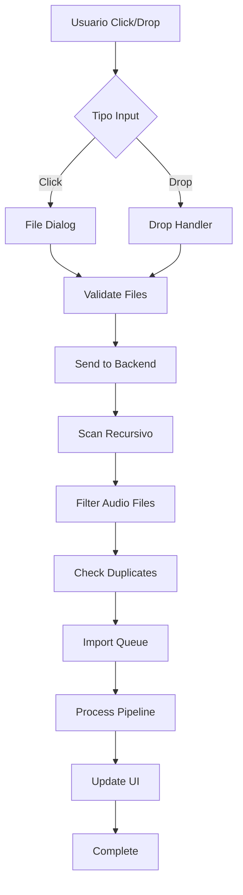

# 🎵 ADD MUSIC BUTTON - Implementación Detallada

## 📋 Tabla de Contenidos

1. [Concepto y Diseño](#concepto-y-diseño)
2. [Arquitectura del Sistema](#arquitectura-del-sistema)
3. [Flujo de Trabajo Completo](#flujo-de-trabajo-completo)
4. [Implementación Frontend](#implementación-frontend)
5. [Implementación Backend](#implementación-backend)
6. [Pipeline de Análisis](#pipeline-de-análisis)
7. [Manejo de Estados y Errores](#manejo-de-estados-y-errores)
8. [Optimizaciones y Performance](#optimizaciones-y-performance)
9. [Testing y Validación](#testing-y-validación)

---

## 🎯 Concepto y Diseño

### Filosofía de Diseño

El botón de agregar música combina **simplicidad visual** con **funcionalidad poderosa**. Fusiona:

- **FAB (Floating Action Button)**: Acceso rápido y constante
- **Drop Zone**: Interacción natural con drag & drop
- **Pipeline Automático**: Cero configuración para el usuario

### Especificaciones Visuales

#### Estado Normal (FAB)

```
Posición: Fixed, bottom: 80px, right: 20px
Tamaño: 56x56px circular
Color: Gradiente #00ff88 → #00cc66
Sombra: 0 4px 12px rgba(0,255,136,0.3)
Icono: "+" centrado, 24px, blanco
Z-index: 9999 (sobre todo excepto modales)
```

#### Estado Hover

```
Transform: scale(1.1)
Sombra: 0 6px 20px rgba(0,255,136,0.5)
Cursor: pointer
Transición: 200ms ease-out
```

#### Estado Activo (Drop Zone)

```
Expansión: Width 300px, Height 200px
Border: 2px dashed #00ff88
Background: rgba(0,255,136,0.05)
Border-radius: 12px
Animación: Pulse suave
```

---

## 🏗️ Arquitectura del Sistema

### Componentes Principales

```
┌─────────────────────────────────────────────────────┐
│                    FRONTEND                         │
├─────────────────────────────────────────────────────┤
│  add-music-button.js                                │
│    ├── UI Control (FAB + Drop Zone)                 │
│    ├── File Selection Dialog                        │
│    ├── Drag & Drop Handler                          │
│    └── Progress Feedback                            │
├─────────────────────────────────────────────────────┤
│                    IPC BRIDGE                       │
├─────────────────────────────────────────────────────┤
│  handlers/import-music-handler.js                   │
│    ├── File System Scanner                          │
│    ├── Queue Manager                                │
│    ├── Pipeline Orchestrator                        │
│    └── Progress Reporter                            │
├─────────────────────────────────────────────────────┤
│                    BACKEND                          │
├─────────────────────────────────────────────────────┤
│  Pipeline Stages:                                   │
│    1. import-to-database.js                         │
│    2. extract-metadata.js                           │
│    3. extract-artwork.js                            │
│    4. calculate-hamms.js                            │
│    5. analyze-essentia.sh                           │
│    6. ai-enrichment.js (opcional)                   │
└─────────────────────────────────────────────────────┘
```

### Flujo de Datos



---

## 🔄 Flujo de Trabajo Completo

### Paso 1: Detección de Input

```javascript
// Usuario puede:
1. Hacer click en el botón FAB
2. Arrastrar archivos sobre el botón
3. Arrastrar archivos sobre la zona expandida
4. Usar keyboard shortcut: Ctrl/Cmd + O
```

### Paso 2: Validación de Archivos

```javascript
// Formatos soportados
const AUDIO_EXTENSIONS = ['.mp3', '.m4a', '.flac', '.wav', '.ogg', '.aac', '.wma', '.aiff', '.ape', '.opus', '.webm'];

// Límites
const MAX_FILE_SIZE = 500 * 1024 * 1024; // 500MB por archivo
const MAX_BATCH_SIZE = 1000; // Máximo 1000 archivos por batch
```

### Paso 3: Escaneo Recursivo

```javascript
// Si es carpeta:
1. Escanear recursivamente todos los subdirectorios
2. Filtrar solo archivos de audio
3. Mantener estructura de carpetas para metadata
4. Detectar compilaciones/albums
```

### Paso 4: Detección de Duplicados

```javascript
// Estrategias de detección:
1. Hash MD5 del archivo
2. Comparación: artist + title + duration (±2 seg)
3. Comparación: file_name + file_size
4. Audio fingerprinting (opcional, usando Chromaprint)
```

### Paso 5: Cola de Procesamiento

```javascript
// Sistema de cola con prioridades:
Priority 1: Archivos pequeños (<10MB)
Priority 2: Archivos con metadata completa
Priority 3: Archivos medianos (10-50MB)
Priority 4: Archivos grandes (>50MB)
Priority 5: Archivos sin metadata
```

### Paso 6: Pipeline de Análisis

#### 6.1 Importación a Base de Datos

```sql
INSERT INTO audio_files (
    file_path, file_name, file_size,
    file_extension, date_added,
    import_batch_id, status
) VALUES (?, ?, ?, ?, datetime('now'), ?, 'pending')
```

#### 6.2 Extracción de Metadata

```javascript
// Usando music-metadata
const metadata = await mm.parseFile(filePath, {
    duration: true,
    skipCovers: false,
    includeChapters: true,
});

// Campos extraídos:
(-title,
    artist,
    album,
    albumartist - year,
    date,
    genre,
    comment - track,
    disk,
    duration - sampleRate,
    bitrate,
    codec - ISRC,
    barcode,
    label);
```

#### 6.3 Extracción de Artwork

```javascript
// Proceso:
1. Buscar en metadata del archivo
2. Si no hay, buscar cover.jpg en carpeta
3. Si no hay, buscar folder.jpg
4. Si no hay, buscar [album_name].jpg
5. Generar thumbnail 300x300
6. Guardar en artwork-cache/{id}.jpg
```

#### 6.4 Cálculo HAMMS

```javascript
// HAMMS: Harmonic-Acoustic Music Matching System
const features = {
    energy: calculateEnergy(audioBuffer),
    danceability: calculateDanceability(tempo, rhythm),
    valence: calculateValence(harmony, mode),
    acousticness: calculateAcousticness(spectral),
    instrumentalness: detectVocals(audioBuffer),
    liveness: detectAudience(audioBuffer),
    speechiness: detectSpeech(audioBuffer),
};
```

#### 6.5 Análisis MixedInKey

```bash
# Si MixedInKey está instalado:
mixedinkey --export csv "$file_path"
# Extrae: BPM exacto, Key musical, Energy level
```

#### 6.6 Análisis Essentia

```python
# essentia_analyzer.py
features = {
    'spectral_centroid': essentia.spectralCentroid(audio),
    'spectral_rolloff': essentia.spectralRolloff(audio),
    'mfcc': essentia.mfcc(audio),
    'onset_rate': essentia.onsetRate(audio),
    'beats': essentia.beatTracker(audio),
    'key': essentia.key(audio),
    'loudness': essentia.loudness(audio)
}
```

#### 6.7 Enriquecimiento AI (Opcional)

```javascript
// Solo si OPENAI_API_KEY está configurada
const enrichment = await openai.complete({
    prompt: buildMusicAnalysisPrompt(metadata, features),
    model: 'gpt-4-turbo',
    temperature: 0.3
});

// Datos enriquecidos:
- Género específico y subgéneros
- Era/época musical
- Artistas similares
- Contexto cultural
- Mood detallado
- Recomendaciones DJ
```

---

## 💻 Implementación Frontend

### HTML Structure

```html
<!-- Add Music Button (FAB + Drop Zone) -->
<div id="add-music-container" class="add-music-container">
    <!-- Floating Action Button -->
    <button id="add-music-fab" class="add-music-fab" title="Add Music (Ctrl+O)">
        <svg class="fab-icon" viewBox="0 0 24 24">
            <path d="M19 13h-6v6h-2v-6H5v-2h6V5h2v6h6v2z" fill="currentColor" />
        </svg>
        <span class="fab-label">Add Music</span>
    </button>

    <!-- Drop Zone (Hidden by default) -->
    <div id="drop-zone" class="drop-zone" style="display: none;">
        <div class="drop-zone-content">
            <svg class="drop-icon" viewBox="0 0 24 24">
                <path
                    d="M19.35 10.04C18.67 6.59 15.64 4 12 4 9.11 4 6.6 5.64 5.35 8.04 2.34 8.36 0 10.91 0 14c0 3.31 2.69 6 6 6h13c2.76 0 5-2.24 5-5 0-2.64-2.05-4.78-4.65-4.96z"
                    fill="currentColor"
                    opacity="0.3"
                />
                <path d="M14 13v4h-4v-4H7l5-5 5 5h-3z" fill="currentColor" />
            </svg>
            <p class="drop-text">Drop audio files here</p>
            <p class="drop-subtext">or click to browse</p>
            <div class="supported-formats">MP3 • FLAC • WAV • M4A • OGG • AAC</div>
        </div>
    </div>

    <!-- Progress Overlay -->
    <div id="import-progress" class="import-progress" style="display: none;">
        <div class="progress-header">
            <span class="progress-title">Importing Music...</span>
            <button class="progress-cancel" onclick="cancelImport()">✕</button>
        </div>
        <div class="progress-details">
            <span id="current-file">Preparing...</span>
            <span id="progress-count">0 / 0</span>
        </div>
        <div class="progress-bar">
            <div id="progress-fill" class="progress-fill" style="width: 0%"></div>
        </div>
        <div class="progress-stages">
            <span class="stage" data-stage="scan">Scanning</span>
            <span class="stage" data-stage="import">Importing</span>
            <span class="stage" data-stage="metadata">Metadata</span>
            <span class="stage" data-stage="artwork">Artwork</span>
            <span class="stage" data-stage="analysis">Analysis</span>
            <span class="stage" data-stage="ai">AI</span>
        </div>
    </div>
</div>
```

### CSS Styles

```css
/* Container */
.add-music-container {
    position: fixed;
    bottom: 80px;
    right: 20px;
    z-index: 9999;
}

/* Floating Action Button */
.add-music-fab {
    width: 56px;
    height: 56px;
    border-radius: 50%;
    background: linear-gradient(135deg, #00ff88, #00cc66);
    border: none;
    box-shadow: 0 4px 12px rgba(0, 255, 136, 0.3);
    cursor: pointer;
    display: flex;
    align-items: center;
    justify-content: center;
    transition: all 0.3s cubic-bezier(0.4, 0, 0.2, 1);
    position: relative;
    overflow: hidden;
}

.add-music-fab:hover {
    transform: scale(1.1);
    box-shadow: 0 6px 20px rgba(0, 255, 136, 0.5);
}

.add-music-fab:active {
    transform: scale(0.95);
}

.fab-icon {
    width: 24px;
    height: 24px;
    color: white;
    transition: transform 0.3s;
}

.add-music-fab.active .fab-icon {
    transform: rotate(45deg);
}

.fab-label {
    position: absolute;
    right: 70px;
    background: rgba(0, 0, 0, 0.8);
    color: white;
    padding: 6px 12px;
    border-radius: 4px;
    font-size: 12px;
    white-space: nowrap;
    opacity: 0;
    pointer-events: none;
    transition: opacity 0.3s;
}

.add-music-fab:hover .fab-label {
    opacity: 1;
}

/* Drop Zone */
.drop-zone {
    position: absolute;
    bottom: 0;
    right: 0;
    width: 300px;
    height: 200px;
    background: rgba(20, 20, 30, 0.98);
    border: 2px dashed rgba(0, 255, 136, 0.3);
    border-radius: 12px;
    display: flex;
    align-items: center;
    justify-content: center;
    transition: all 0.3s cubic-bezier(0.4, 0, 0.2, 1);
    backdrop-filter: blur(10px);
}

.drop-zone.active {
    border-color: #00ff88;
    background: rgba(0, 255, 136, 0.05);
    transform: scale(1.02);
}

.drop-zone.drag-over {
    border-color: #00ff88;
    background: rgba(0, 255, 136, 0.1);
    box-shadow: 0 0 30px rgba(0, 255, 136, 0.3);
}

.drop-zone-content {
    text-align: center;
    pointer-events: none;
}

.drop-icon {
    width: 48px;
    height: 48px;
    color: rgba(0, 255, 136, 0.5);
    margin-bottom: 12px;
}

.drop-text {
    color: rgba(255, 255, 255, 0.9);
    font-size: 16px;
    font-weight: 500;
    margin: 0 0 4px 0;
}

.drop-subtext {
    color: rgba(255, 255, 255, 0.5);
    font-size: 13px;
    margin: 0 0 12px 0;
}

.supported-formats {
    color: rgba(0, 255, 136, 0.6);
    font-size: 11px;
    font-family: monospace;
}

/* Progress Overlay */
.import-progress {
    position: absolute;
    bottom: 0;
    right: 0;
    width: 350px;
    background: rgba(20, 20, 30, 0.98);
    border-radius: 12px;
    padding: 20px;
    backdrop-filter: blur(20px);
    box-shadow: 0 10px 40px rgba(0, 0, 0, 0.5);
}

.progress-header {
    display: flex;
    justify-content: space-between;
    align-items: center;
    margin-bottom: 16px;
}

.progress-title {
    color: white;
    font-size: 14px;
    font-weight: 600;
}

.progress-cancel {
    background: none;
    border: none;
    color: rgba(255, 255, 255, 0.5);
    cursor: pointer;
    font-size: 18px;
    padding: 0;
    width: 24px;
    height: 24px;
    display: flex;
    align-items: center;
    justify-content: center;
    border-radius: 50%;
    transition: all 0.2s;
}

.progress-cancel:hover {
    background: rgba(255, 255, 255, 0.1);
    color: #ff4444;
}

.progress-details {
    display: flex;
    justify-content: space-between;
    margin-bottom: 12px;
}

#current-file {
    color: rgba(255, 255, 255, 0.7);
    font-size: 12px;
    overflow: hidden;
    text-overflow: ellipsis;
    white-space: nowrap;
    flex: 1;
    margin-right: 12px;
}

#progress-count {
    color: rgba(0, 255, 136, 0.8);
    font-size: 12px;
    font-weight: 600;
}

.progress-bar {
    height: 4px;
    background: rgba(255, 255, 255, 0.1);
    border-radius: 2px;
    overflow: hidden;
    margin-bottom: 16px;
}

.progress-fill {
    height: 100%;
    background: linear-gradient(90deg, #00ff88, #00cc66);
    border-radius: 2px;
    transition: width 0.3s ease;
    box-shadow: 0 0 10px rgba(0, 255, 136, 0.5);
}

.progress-stages {
    display: flex;
    justify-content: space-between;
    gap: 8px;
}

.stage {
    color: rgba(255, 255, 255, 0.3);
    font-size: 10px;
    text-transform: uppercase;
    letter-spacing: 0.5px;
    transition: color 0.3s;
}

.stage.active {
    color: #00ff88;
    font-weight: 600;
}

.stage.completed {
    color: rgba(0, 255, 136, 0.6);
}

/* Animations */
@keyframes pulse {
    0% {
        box-shadow: 0 0 0 0 rgba(0, 255, 136, 0.4);
    }
    70% {
        box-shadow: 0 0 0 20px rgba(0, 255, 136, 0);
    }
    100% {
        box-shadow: 0 0 0 0 rgba(0, 255, 136, 0);
    }
}

.add-music-fab.processing {
    animation: pulse 2s infinite;
}

/* Responsive */
@media (max-width: 768px) {
    .add-music-container {
        bottom: 70px;
        right: 15px;
    }

    .add-music-fab {
        width: 48px;
        height: 48px;
    }

    .drop-zone {
        width: calc(100vw - 30px);
        left: 15px;
        right: 15px;
    }

    .import-progress {
        width: calc(100vw - 30px);
        left: 15px;
        right: 15px;
    }
}
```

### JavaScript Implementation

```javascript
// add-music-button.js
class AddMusicButton {
    constructor() {
        this.container = null;
        this.fab = null;
        this.dropZone = null;
        this.progressOverlay = null;
        this.isProcessing = false;
        this.importQueue = [];
        this.currentBatch = null;
        this.abortController = null;

        this.init();
    }

    init() {
        this.createElements();
        this.attachEventListeners();
        this.setupDragAndDrop();
        this.setupKeyboardShortcuts();
    }

    createElements() {
        // Create container and elements as defined in HTML above
        const html = `...`; // Full HTML from above
        const container = document.createElement('div');
        container.innerHTML = html;
        document.body.appendChild(container.firstElementChild);

        this.container = document.getElementById('add-music-container');
        this.fab = document.getElementById('add-music-fab');
        this.dropZone = document.getElementById('drop-zone');
        this.progressOverlay = document.getElementById('import-progress');
    }

    attachEventListeners() {
        // FAB click
        this.fab.addEventListener('click', () => this.handleFabClick());

        // Drop zone click
        this.dropZone.addEventListener('click', () => this.openFileDialog());

        // Cancel button
        document.querySelector('.progress-cancel').addEventListener('click', () => this.cancelImport());
    }

    setupDragAndDrop() {
        // Prevent default drag behaviors
        ['dragenter', 'dragover', 'dragleave', 'drop'].forEach((eventName) => {
            document.addEventListener(
                eventName,
                (e) => {
                    e.preventDefault();
                    e.stopPropagation();
                },
                false
            );
        });

        // Drag enter/over - show drop zone
        ['dragenter', 'dragover'].forEach((eventName) => {
            document.addEventListener(eventName, (e) => {
                if (this.isDraggedDataValid(e)) {
                    this.showDropZone();
                    this.dropZone.classList.add('drag-over');
                }
            });
        });

        // Drag leave
        document.addEventListener('dragleave', (e) => {
            if (e.clientX === 0 && e.clientY === 0) {
                this.dropZone.classList.remove('drag-over');
            }
        });

        // Drop
        document.addEventListener('drop', (e) => {
            if (this.isDraggedDataValid(e)) {
                this.handleDrop(e);
            }
        });
    }

    setupKeyboardShortcuts() {
        document.addEventListener('keydown', (e) => {
            // Ctrl/Cmd + O to open file dialog
            if ((e.ctrlKey || e.metaKey) && e.key === 'o') {
                e.preventDefault();
                this.openFileDialog();
            }
        });
    }

    handleFabClick() {
        if (this.isProcessing) {
            // Show progress if processing
            this.progressOverlay.style.display = 'block';
        } else {
            // Toggle drop zone
            this.toggleDropZone();
        }
    }

    toggleDropZone() {
        const isVisible = this.dropZone.style.display === 'block';

        if (isVisible) {
            this.hideDropZone();
        } else {
            this.showDropZone();
        }
    }

    showDropZone() {
        this.dropZone.style.display = 'block';
        this.fab.classList.add('active');

        // Animate entrance
        requestAnimationFrame(() => {
            this.dropZone.classList.add('active');
        });
    }

    hideDropZone() {
        this.dropZone.classList.remove('active');
        this.fab.classList.remove('active');

        setTimeout(() => {
            this.dropZone.style.display = 'none';
            this.dropZone.classList.remove('drag-over');
        }, 300);
    }

    isDraggedDataValid(e) {
        const dt = e.dataTransfer;
        if (!dt || !dt.types) return false;

        // Check if files are being dragged
        return dt.types.includes('Files') || dt.types.includes('application/x-moz-file');
    }

    async handleDrop(e) {
        this.dropZone.classList.remove('drag-over');

        const files = Array.from(e.dataTransfer.files);
        const paths = await this.processDroppedItems(e.dataTransfer.items);

        if (paths.length > 0) {
            this.startImport(paths);
        }
    }

    async processDroppedItems(items) {
        const paths = [];

        for (const item of items) {
            if (item.kind === 'file') {
                const entry = item.webkitGetAsEntry();
                if (entry) {
                    const filePaths = await this.traverseFileTree(entry);
                    paths.push(...filePaths);
                }
            }
        }

        return paths;
    }

    async traverseFileTree(entry, path = '') {
        const paths = [];

        if (entry.isFile) {
            // Check if audio file
            if (this.isAudioFile(entry.name)) {
                const file = await this.getFile(entry);
                paths.push(file.path || file.name);
            }
        } else if (entry.isDirectory) {
            const reader = entry.createReader();
            const entries = await this.readAllEntries(reader);

            for (const childEntry of entries) {
                const childPaths = await this.traverseFileTree(childEntry);
                paths.push(...childPaths);
            }
        }

        return paths;
    }

    async readAllEntries(reader) {
        const entries = [];
        let batch;

        do {
            batch = await new Promise((resolve, reject) => {
                reader.readEntries(resolve, reject);
            });
            entries.push(...batch);
        } while (batch.length > 0);

        return entries;
    }

    async getFile(entry) {
        return new Promise((resolve, reject) => {
            entry.file(resolve, reject);
        });
    }

    isAudioFile(filename) {
        const ext = filename.toLowerCase().split('.').pop();
        const audioExtensions = ['mp3', 'm4a', 'flac', 'wav', 'ogg', 'aac', 'wma', 'aiff', 'ape', 'opus', 'webm'];
        return audioExtensions.includes(ext);
    }

    async openFileDialog() {
        try {
            const result = await window.ipcRenderer.invoke('select-music-files');

            if (result && result.filePaths && result.filePaths.length > 0) {
                this.startImport(result.filePaths);
            }
        } catch (error) {
            console.error('Error opening file dialog:', error);
            this.showError('Failed to open file selector');
        }
    }

    async startImport(paths) {
        if (this.isProcessing) {
            this.showError('Import already in progress');
            return;
        }

        this.isProcessing = true;
        this.importQueue = paths;
        this.abortController = new AbortController();

        // Update UI
        this.hideDropZone();
        this.showProgress();
        this.fab.classList.add('processing');

        try {
            // Start import process
            const result = await window.ipcRenderer.invoke('import-music', {
                paths: paths,
                options: {
                    checkDuplicates: true,
                    extractArtwork: true,
                    runAnalysis: true,
                    runAI: false, // Optional AI enrichment
                },
            });

            this.handleImportComplete(result);
        } catch (error) {
            console.error('Import error:', error);
            this.handleImportError(error);
        }
    }

    showProgress() {
        this.progressOverlay.style.display = 'block';
        this.updateProgress(0, 0, 'Initializing...');
        this.setActiveStage('scan');
    }

    hideProgress() {
        this.progressOverlay.style.display = 'none';
        this.fab.classList.remove('processing');
    }

    updateProgress(current, total, fileName = '') {
        const progressFill = document.getElementById('progress-fill');
        const progressCount = document.getElementById('progress-count');
        const currentFile = document.getElementById('current-file');

        const percentage = total > 0 ? (current / total) * 100 : 0;

        progressFill.style.width = `${percentage}%`;
        progressCount.textContent = `${current} / ${total}`;

        if (fileName) {
            const shortName = fileName.length > 40 ? '...' + fileName.slice(-37) : fileName;
            currentFile.textContent = shortName;
        }
    }

    setActiveStage(stageName) {
        document.querySelectorAll('.stage').forEach((stage) => {
            stage.classList.remove('active');
            if (stage.dataset.stage === stageName) {
                stage.classList.add('active');
            } else if (this.getStageOrder(stage.dataset.stage) < this.getStageOrder(stageName)) {
                stage.classList.add('completed');
            }
        });
    }

    getStageOrder(stage) {
        const order = {
            scan: 0,
            import: 1,
            metadata: 2,
            artwork: 3,
            analysis: 4,
            ai: 5,
        };
        return order[stage] || 999;
    }

    async cancelImport() {
        if (this.abortController) {
            this.abortController.abort();
        }

        try {
            await window.ipcRenderer.invoke('cancel-import');
        } catch (error) {
            console.error('Error canceling import:', error);
        }

        this.isProcessing = false;
        this.hideProgress();
        this.showNotification('Import canceled', 'warning');
    }

    handleImportComplete(result) {
        this.isProcessing = false;
        this.hideProgress();

        const message = `Successfully imported ${result.imported} tracks`;
        this.showNotification(message, 'success');

        // Refresh the main track list
        if (window.loadFiles) {
            window.loadFiles();
        }

        // Show summary if there were issues
        if (result.skipped > 0 || result.failed > 0) {
            this.showImportSummary(result);
        }
    }

    handleImportError(error) {
        this.isProcessing = false;
        this.hideProgress();

        const message = error.message || 'Import failed';
        this.showNotification(message, 'error');
    }

    showImportSummary(result) {
        const summary = `
            Import Complete:
            ✅ Imported: ${result.imported}
            ⏭️ Skipped (duplicates): ${result.skipped}
            ❌ Failed: ${result.failed}
            
            Total time: ${result.duration}s
        `;

        // You can show this in a modal or notification
        console.log(summary);
    }

    showNotification(message, type = 'info') {
        if (window.showToast) {
            window.showToast(message, type);
        } else {
            console.log(`[${type.toUpperCase()}] ${message}`);
        }
    }

    showError(message) {
        this.showNotification(message, 'error');
    }
}

// Initialize when DOM is ready
if (document.readyState === 'loading') {
    document.addEventListener('DOMContentLoaded', () => {
        window.addMusicButton = new AddMusicButton();
    });
} else {
    window.addMusicButton = new AddMusicButton();
}

// Listen for progress updates from backend
window.ipcRenderer.on('import-progress', (event, data) => {
    if (window.addMusicButton) {
        window.addMusicButton.updateProgress(data.current, data.total, data.fileName);

        if (data.stage) {
            window.addMusicButton.setActiveStage(data.stage);
        }
    }
});
```

---

## 🔧 Implementación Backend

### Main Process Handler (main.js)

```javascript
// Add to main.js
const { createImportMusicHandler } = require('./handlers/import-music-handler');

// Register IPC handlers
ipcMain.handle('select-music-files', async () => {
    return dialog.showOpenDialog(mainWindow, {
        title: 'Select Music Files or Folders',
        properties: ['openFile', 'openDirectory', 'multiSelections'],
        filters: [
            {
                name: 'Audio Files',
                extensions: ['mp3', 'm4a', 'flac', 'wav', 'ogg', 'aac', 'wma', 'aiff', 'ape', 'opus', 'webm'],
            },
            { name: 'All Files', extensions: ['*'] },
        ],
    });
});

const importHandler = createImportMusicHandler(db);
ipcMain.handle('import-music', importHandler.processImport);
ipcMain.handle('cancel-import', importHandler.cancelImport);
```

### Import Music Handler

```javascript
// handlers/import-music-handler.js
const fs = require('fs').promises;
const path = require('path');
const crypto = require('crypto');
const mm = require('music-metadata');
const { exec } = require('child_process');
const { promisify } = require('util');
const execAsync = promisify(exec);

class ImportMusicHandler {
    constructor(db) {
        this.db = db;
        this.isProcessing = false;
        this.shouldCancel = false;
        this.currentBatch = null;
        this.progressCallback = null;
    }

    async processImport(event, { paths, options }) {
        if (this.isProcessing) {
            throw new Error('Import already in progress');
        }

        this.isProcessing = true;
        this.shouldCancel = false;
        const startTime = Date.now();

        const result = {
            imported: 0,
            skipped: 0,
            failed: 0,
            errors: [],
            duration: 0,
        };

        try {
            // Stage 1: Scan for audio files
            this.sendProgress(event, 0, 1, 'Scanning...', 'scan');
            const audioFiles = await this.scanForAudioFiles(paths);

            if (audioFiles.length === 0) {
                throw new Error('No audio files found');
            }

            // Stage 2: Check for duplicates
            const uniqueFiles = options.checkDuplicates ? await this.filterDuplicates(audioFiles) : audioFiles;

            result.skipped = audioFiles.length - uniqueFiles.length;

            // Stage 3: Process each file
            for (let i = 0; i < uniqueFiles.length; i++) {
                if (this.shouldCancel) {
                    break;
                }

                const file = uniqueFiles[i];
                const fileName = path.basename(file);

                try {
                    // Update progress
                    this.sendProgress(event, i + 1, uniqueFiles.length, fileName, 'import');

                    // Process file through pipeline
                    await this.processFile(file, options, event);
                    result.imported++;
                } catch (error) {
                    console.error(`Failed to import ${fileName}:`, error);
                    result.failed++;
                    result.errors.push({
                        file: fileName,
                        error: error.message,
                    });
                }
            }
        } catch (error) {
            console.error('Import process error:', error);
            throw error;
        } finally {
            this.isProcessing = false;
            result.duration = Math.round((Date.now() - startTime) / 1000);
        }

        return result;
    }

    async scanForAudioFiles(paths) {
        const audioFiles = [];
        const audioExtensions = [
            '.mp3',
            '.m4a',
            '.flac',
            '.wav',
            '.ogg',
            '.aac',
            '.wma',
            '.aiff',
            '.ape',
            '.opus',
            '.webm',
        ];

        for (const inputPath of paths) {
            try {
                const stat = await fs.stat(inputPath);

                if (stat.isDirectory()) {
                    // Recursive scan
                    const files = await this.scanDirectory(inputPath, audioExtensions);
                    audioFiles.push(...files);
                } else if (stat.isFile()) {
                    // Single file
                    const ext = path.extname(inputPath).toLowerCase();
                    if (audioExtensions.includes(ext)) {
                        audioFiles.push(inputPath);
                    }
                }
            } catch (error) {
                console.error(`Error scanning ${inputPath}:`, error);
            }
        }

        return audioFiles;
    }

    async scanDirectory(dir, extensions) {
        const files = [];

        try {
            const entries = await fs.readdir(dir, { withFileTypes: true });

            for (const entry of entries) {
                const fullPath = path.join(dir, entry.name);

                if (entry.isDirectory()) {
                    // Recursive scan subdirectories
                    const subFiles = await this.scanDirectory(fullPath, extensions);
                    files.push(...subFiles);
                } else if (entry.isFile()) {
                    const ext = path.extname(entry.name).toLowerCase();
                    if (extensions.includes(ext)) {
                        files.push(fullPath);
                    }
                }
            }
        } catch (error) {
            console.error(`Error scanning directory ${dir}:`, error);
        }

        return files;
    }

    async filterDuplicates(files) {
        const uniqueFiles = [];

        for (const file of files) {
            const isDuplicate = await this.checkDuplicate(file);
            if (!isDuplicate) {
                uniqueFiles.push(file);
            }
        }

        return uniqueFiles;
    }

    async checkDuplicate(filePath) {
        return new Promise((resolve) => {
            // Check by file path
            this.db.get('SELECT id FROM audio_files WHERE file_path = ?', [filePath], async (err, row) => {
                if (row) {
                    resolve(true); // Duplicate found
                    return;
                }

                // Check by hash (optional, more intensive)
                try {
                    const hash = await this.calculateFileHash(filePath);

                    this.db.get('SELECT id FROM audio_files WHERE file_hash = ?', [hash], (err, row) => {
                        resolve(!!row);
                    });
                } catch (error) {
                    // If hash fails, assume not duplicate
                    resolve(false);
                }
            });
        });
    }

    async calculateFileHash(filePath) {
        const hash = crypto.createHash('md5');
        const stream = require('fs').createReadStream(filePath);

        return new Promise((resolve, reject) => {
            stream.on('data', (data) => hash.update(data));
            stream.on('end', () => resolve(hash.digest('hex')));
            stream.on('error', reject);
        });
    }

    async processFile(filePath, options, event) {
        const fileId = await this.importToDatabase(filePath);

        // Stage: Metadata extraction
        this.sendProgress(event, null, null, path.basename(filePath), 'metadata');
        await this.extractMetadata(fileId, filePath);

        // Stage: Artwork extraction
        if (options.extractArtwork) {
            this.sendProgress(event, null, null, path.basename(filePath), 'artwork');
            await this.extractArtwork(fileId, filePath);
        }

        // Stage: Audio analysis
        if (options.runAnalysis) {
            this.sendProgress(event, null, null, path.basename(filePath), 'analysis');
            await this.runAnalysis(fileId, filePath);
        }

        // Stage: AI enrichment (optional)
        if (options.runAI && process.env.OPENAI_API_KEY) {
            this.sendProgress(event, null, null, path.basename(filePath), 'ai');
            await this.runAIEnrichment(fileId, filePath);
        }
    }

    async importToDatabase(filePath) {
        return new Promise((resolve, reject) => {
            const fileName = path.basename(filePath);
            const fileExt = path.extname(filePath).slice(1);
            const fileSize = require('fs').statSync(filePath).size;

            this.db.run(
                `INSERT INTO audio_files (
                    file_path, file_name, file_extension, 
                    file_size, created_at, updated_at
                ) VALUES (?, ?, ?, ?, datetime('now'), datetime('now'))`,
                [filePath, fileName, fileExt, fileSize],
                function (err) {
                    if (err) reject(err);
                    else resolve(this.lastID);
                }
            );
        });
    }

    async extractMetadata(fileId, filePath) {
        try {
            const metadata = await mm.parseFile(filePath, {
                duration: true,
                skipCovers: false,
            });

            const updates = {
                title: metadata.common.title,
                artist: metadata.common.artist,
                album: metadata.common.album,
                albumartist: metadata.common.albumartist,
                year: metadata.common.year,
                genre: metadata.common.genre?.join(', '),
                track: metadata.common.track?.no,
                disk: metadata.common.disk?.no,
                duration: metadata.format.duration,
                bitrate: metadata.format.bitrate,
                sampleRate: metadata.format.sampleRate,
                codec: metadata.format.codec,
            };

            // Update database
            const setClause = Object.keys(updates)
                .filter((key) => updates[key] !== undefined)
                .map((key) => `${key} = ?`)
                .join(', ');

            const values = Object.values(updates).filter((val) => val !== undefined);

            if (values.length > 0) {
                values.push(fileId);

                await new Promise((resolve, reject) => {
                    this.db.run(`UPDATE audio_files SET ${setClause} WHERE id = ?`, values, (err) =>
                        err ? reject(err) : resolve()
                    );
                });
            }
        } catch (error) {
            console.error('Metadata extraction error:', error);
            throw error;
        }
    }

    async extractArtwork(fileId, filePath) {
        try {
            const metadata = await mm.parseFile(filePath);
            const pictures = metadata.common.picture;

            if (pictures && pictures.length > 0) {
                const picture = pictures[0];
                const outputPath = path.join('artwork-cache', `${fileId}.jpg`);

                await fs.writeFile(outputPath, picture.data);

                // Update database
                await new Promise((resolve, reject) => {
                    this.db.run('UPDATE audio_files SET artwork_path = ? WHERE id = ?', [outputPath, fileId], (err) =>
                        err ? reject(err) : resolve()
                    );
                });
            }
        } catch (error) {
            console.error('Artwork extraction error:', error);
            // Don't throw - artwork is optional
        }
    }

    async runAnalysis(fileId, filePath) {
        try {
            // Call existing analysis scripts
            const commands = [
                `python3 calculate_audio_features.py "${filePath}" ${fileId}`,
                `./analyze_step3_only.sh "${filePath}" ${fileId}`,
            ];

            for (const cmd of commands) {
                try {
                    await execAsync(cmd);
                } catch (error) {
                    console.error(`Analysis command failed: ${cmd}`, error);
                }
            }
        } catch (error) {
            console.error('Analysis error:', error);
            // Don't throw - analysis can fail gracefully
        }
    }

    async runAIEnrichment(fileId, filePath) {
        try {
            const cmd = `python3 openai_processor.py "${filePath}" ${fileId}`;
            await execAsync(cmd);
        } catch (error) {
            console.error('AI enrichment error:', error);
            // Don't throw - AI is optional
        }
    }

    sendProgress(event, current, total, fileName, stage) {
        if (event && event.sender) {
            event.sender.send('import-progress', {
                current,
                total,
                fileName,
                stage,
            });
        }
    }

    cancelImport() {
        this.shouldCancel = true;
        return { success: true };
    }
}

function createImportMusicHandler(db) {
    const handler = new ImportMusicHandler(db);

    return {
        processImport: (event, data) => handler.processImport(event, data),
        cancelImport: () => handler.cancelImport(),
    };
}

module.exports = { createImportMusicHandler };
```

---

## 🔄 Pipeline de Análisis

### Orden de Ejecución

```
1. Import to DB       (1ms)     - Registro inicial
2. Extract Metadata   (50ms)    - music-metadata
3. Extract Artwork    (100ms)   - Carátula si existe
4. Calculate HAMMS    (500ms)   - Features básicos
5. MixedInKey        (1000ms)   - Si está instalado
6. Essentia Analysis (2000ms)   - Features avanzados
7. AI Enrichment     (3000ms)   - Opcional con API key
```

### Scripts de Análisis Existentes

#### analyze_complete.sh

```bash
#!/bin/bash
# Pipeline completo de análisis

FILE_PATH="$1"
FILE_ID="$2"

# Step 1: Import MixedInKey metadata
python3 import_mixedinkey_metadata.py "$FILE_PATH"

# Step 2: Calculate audio features
python3 calculate_audio_features.py "$FILE_PATH" "$FILE_ID"

# Step 3: Essentia analysis
python3 essentia_analyzer.py "$FILE_PATH" "$FILE_ID"

# Step 4: AI enrichment (optional)
if [ ! -z "$OPENAI_API_KEY" ]; then
    python3 openai_processor.py "$FILE_PATH" "$FILE_ID"
fi
```

---

## 🚨 Manejo de Estados y Errores

### Estados del Sistema

```javascript
const ImportStates = {
    IDLE: 'idle',
    SCANNING: 'scanning',
    IMPORTING: 'importing',
    PROCESSING: 'processing',
    COMPLETED: 'completed',
    FAILED: 'failed',
    CANCELLED: 'cancelled',
};
```

### Manejo de Errores

```javascript
class ImportError extends Error {
    constructor(message, code, details) {
        super(message);
        this.name = 'ImportError';
        this.code = code;
        this.details = details;
    }
}

// Error codes
const ErrorCodes = {
    NO_FILES: 'NO_FILES',
    INVALID_FORMAT: 'INVALID_FORMAT',
    FILE_TOO_LARGE: 'FILE_TOO_LARGE',
    DUPLICATE_FILE: 'DUPLICATE_FILE',
    METADATA_EXTRACTION_FAILED: 'METADATA_EXTRACTION_FAILED',
    ANALYSIS_FAILED: 'ANALYSIS_FAILED',
    DATABASE_ERROR: 'DATABASE_ERROR',
    PERMISSION_DENIED: 'PERMISSION_DENIED',
    DISK_FULL: 'DISK_FULL',
    CANCELLED_BY_USER: 'CANCELLED_BY_USER',
};
```

### Recovery Strategies

```javascript
// Retry logic for transient failures
async function retryOperation(operation, maxRetries = 3) {
    for (let i = 0; i < maxRetries; i++) {
        try {
            return await operation();
        } catch (error) {
            if (i === maxRetries - 1) throw error;

            // Exponential backoff
            await new Promise((resolve) => setTimeout(resolve, Math.pow(2, i) * 1000));
        }
    }
}

// Graceful degradation
async function processWithFallback(file, processors) {
    const results = {};

    for (const [name, processor] of Object.entries(processors)) {
        try {
            results[name] = await processor(file);
        } catch (error) {
            console.warn(`Processor ${name} failed, skipping:`, error);
            results[name] = null;
        }
    }

    return results;
}
```

---

## ⚡ Optimizaciones y Performance

### Batch Processing

```javascript
// Process files in batches to avoid overwhelming the system
const BATCH_SIZE = 10;

async function processBatch(files, processor) {
    const results = [];

    for (let i = 0; i < files.length; i += BATCH_SIZE) {
        const batch = files.slice(i, i + BATCH_SIZE);
        const batchResults = await Promise.all(
            batch.map((file) =>
                processor(file).catch((err) => ({
                    file,
                    error: err,
                }))
            )
        );
        results.push(...batchResults);

        // Small delay between batches
        await new Promise((resolve) => setTimeout(resolve, 100));
    }

    return results;
}
```

### Memory Management

```javascript
// Stream large files instead of loading into memory
async function processLargeFile(filePath) {
    const stream = fs.createReadStream(filePath, {
        highWaterMark: 16 * 1024, // 16KB chunks
    });

    const processor = new AudioProcessor();

    return new Promise((resolve, reject) => {
        stream.on('data', (chunk) => processor.process(chunk));
        stream.on('end', () => resolve(processor.getResult()));
        stream.on('error', reject);
    });
}
```

### Parallel Processing

```javascript
// Use worker threads for CPU-intensive tasks
const { Worker } = require('worker_threads');

async function analyzeWithWorker(filePath) {
    return new Promise((resolve, reject) => {
        const worker = new Worker('./workers/audio-analyzer.js', {
            workerData: { filePath },
        });

        worker.on('message', resolve);
        worker.on('error', reject);
        worker.on('exit', (code) => {
            if (code !== 0) {
                reject(new Error(`Worker stopped with exit code ${code}`));
            }
        });
    });
}
```

### Caching

```javascript
// Cache analysis results to avoid reprocessing
class AnalysisCache {
    constructor() {
        this.cache = new Map();
        this.maxSize = 100;
    }

    async get(fileHash) {
        if (this.cache.has(fileHash)) {
            const entry = this.cache.get(fileHash);
            // Move to end (LRU)
            this.cache.delete(fileHash);
            this.cache.set(fileHash, entry);
            return entry;
        }
        return null;
    }

    async set(fileHash, data) {
        // Remove oldest if at capacity
        if (this.cache.size >= this.maxSize) {
            const firstKey = this.cache.keys().next().value;
            this.cache.delete(firstKey);
        }

        this.cache.set(fileHash, {
            data,
            timestamp: Date.now(),
        });
    }
}
```

---

## 🧪 Testing y Validación

### Unit Tests

```javascript
// test/add-music-button.test.js
describe('AddMusicButton', () => {
    let button;

    beforeEach(() => {
        button = new AddMusicButton();
    });

    test('should initialize with correct state', () => {
        expect(button.isProcessing).toBe(false);
        expect(button.importQueue).toEqual([]);
        expect(button.fab).toBeDefined();
    });

    test('should validate audio files correctly', () => {
        expect(button.isAudioFile('test.mp3')).toBe(true);
        expect(button.isAudioFile('test.flac')).toBe(true);
        expect(button.isAudioFile('test.txt')).toBe(false);
    });

    test('should handle drag and drop', async () => {
        const mockEvent = {
            preventDefault: jest.fn(),
            dataTransfer: {
                files: [new File([''], 'test.mp3')],
            },
        };

        await button.handleDrop(mockEvent);
        expect(button.isProcessing).toBe(true);
    });
});
```

### Integration Tests

```javascript
// test/import-pipeline.test.js
describe('Import Pipeline', () => {
    test('should process file through complete pipeline', async () => {
        const testFile = './test-files/sample.mp3';
        const handler = new ImportMusicHandler(mockDb);

        const result = await handler.processFile(testFile, {
            extractArtwork: true,
            runAnalysis: true,
            runAI: false,
        });

        expect(result).toHaveProperty('id');
        expect(result).toHaveProperty('metadata');
        expect(result).toHaveProperty('features');
    });
});
```

### E2E Tests

```javascript
// test/e2e/add-music-flow.test.js
describe('Add Music E2E', () => {
    test('complete flow from button click to database', async () => {
        // 1. Click button
        await page.click('#add-music-fab');

        // 2. Select file
        const [fileChooser] = await Promise.all([page.waitForFileChooser(), page.click('.drop-zone')]);
        await fileChooser.accept(['./test-files/sample.mp3']);

        // 3. Wait for import
        await page.waitForSelector('.import-progress', { visible: true });
        await page.waitForSelector('.import-progress', { hidden: true });

        // 4. Verify in database
        const tracks = await page.evaluate(() => window.allTracks.length);
        expect(tracks).toBeGreaterThan(0);
    });
});
```

---

## 📝 Notas de Implementación

### Consideraciones de Seguridad

1. **Validación de archivos**: Verificar MIME types, no solo extensiones
2. **Límites de tamaño**: Prevenir DoS con archivos enormes
3. **Sanitización de paths**: Evitar path traversal attacks
4. **Rate limiting**: Limitar importaciones concurrentes
5. **Sandboxing**: Ejecutar análisis en proceso separado

### Consideraciones de UX

1. **Feedback inmediato**: Mostrar progreso desde el primer momento
2. **Cancelación clara**: Permitir cancelar en cualquier momento
3. **Resumen post-import**: Mostrar qué se importó exitosamente
4. **Manejo de errores**: Mensajes claros y accionables
5. **Persistencia**: Guardar estado si la app se cierra

### Consideraciones de Performance

1. **Lazy loading**: No cargar toda la biblioteca después de import
2. **Incremental updates**: Actualizar UI progresivamente
3. **Background processing**: No bloquear UI durante análisis
4. **Deduplication**: Evitar re-análisis de archivos idénticos
5. **Resource throttling**: Limitar uso de CPU/memoria

### Futuras Mejoras

1. **Watch folder**: Monitorear carpeta para auto-import
2. **Cloud sync**: Sincronizar con servicios cloud
3. **Metadata editing**: Editar metadata antes de import
4. **Import profiles**: Diferentes configuraciones de import
5. **Undo/Redo**: Deshacer importaciones recientes
6. **Import history**: Log detallado de todas las importaciones
7. **Duplicate resolution**: UI para resolver duplicados manualmente
8. **Format conversion**: Convertir formatos no soportados
9. **Playlist import**: Importar playlists M3U/PLS
10. **Network drives**: Soporte para unidades de red

---

## 🚀 Comando de Implementación Rápida

```bash
# 1. Crear archivos
touch js/add-music-button.js
touch css/add-music-button.css
touch handlers/import-music-handler.js

# 2. Agregar al HTML principal
echo '<script src="js/add-music-button.js"></script>' >> index-views.html
echo '<link rel="stylesheet" href="css/add-music-button.css">' >> index-views.html

# 3. Test rápido
npm start
```

---

**Última actualización**: 2025-08-20
**Versión**: 1.0.0
**Estado**: Listo para implementación
**Tiempo estimado**: 45-60 minutos
