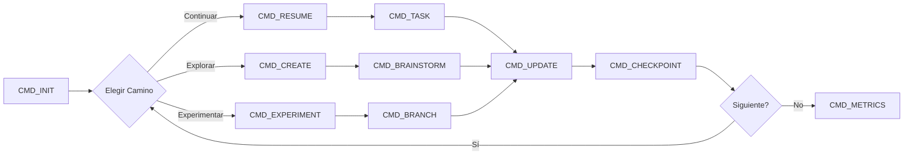

# 🤝 COLLABORATION_FRAMEWORK.md
> Framework de Colaboración Claude-Humano para Music Analyzer
> Version: 2.0 - Modo Creativo Estructurado
> Path: `/Users/freddymolina/Desktop/pro2/music-analyzer-electron/music-app-clean`

---

## 🎯 FILOSOFÍA DE TRABAJO

### Principios Fundamentales
```yaml
1. CONTINUIDAD: Cada sesión construye sobre la anterior
2. CREATIVIDAD: Proponer mejoras dentro del framework
3. EFICIENCIA: Comandos cortos, acciones específicas  
4. DOCUMENTACIÓN: Todo cambio queda registrado
5. AUTONOMÍA: Claude puede sugerir, humano decide
```

---

## 📚 COMANDOS DEL FRAMEWORK

### 🟢 COMANDOS DE INICIO DE SESIÓN

#### `CMD_INIT` - Inicializar Sesión
```bash
claude "CMD_INIT: Lee MUSIC_ANALYZER_SESSION_STATE.md y COLLABORATION_FRAMEWORK.md. 
Confirma el estado actual y sugiere 3 posibles caminos creativos para esta sesión 
basados en CURRENT_CHECKPOINT."
```
**Claude responde con:**
- ✅ Confirmación del checkpoint actual
- 💡 3 propuestas creativas alineadas con el proyecto
- ⏱️ Estimación de tiempo para cada opción

#### `CMD_RESUME` - Retomar Trabajo Simple
```bash
claude "CMD_RESUME: Continúa desde CURRENT_CHECKPOINT sin explicaciones."
```

---

### 🔨 COMANDOS DE TRABAJO

#### `CMD_TASK` - Ejecutar Tarea Específica
```bash
claude "CMD_TASK [TASK_ID]: Ejecuta la tarea especificada. 
Si encuentras una mejor forma, propón VARIANTE pero implementa la original primero."
```

**Ejemplo:**
```bash
claude "CMD_TASK 008: Implementa sliders BPM/Energy. 
Si tienes ideas para mejorar UX, documéntalas como SUGERENCIA_008_A."
```

#### `CMD_CREATE` - Modo Creativo
```bash
claude "CMD_CREATE [ÁREA]: Propón 3 soluciones creativas para [ÁREA]. 
Incluye pros/contras y código ejemplo. No implementes aún."
```

**Ejemplo:**
```bash
claude "CMD_CREATE visualización: Propón 3 formas creativas de mostrar 
BPM/Energy sin usar sliders tradicionales."
```

#### `CMD_FIX` - Resolver Problema
```bash
claude "CMD_FIX [DESCRIPCIÓN]: Analiza el problema, propón 2 soluciones 
(una conservadora, una creativa), implementa la conservadora."
```

#### `CMD_OPTIMIZE` - Mejorar Performance
```bash
claude "CMD_OPTIMIZE [COMPONENTE]: Analiza y optimiza manteniendo funcionalidad. 
Documenta mejoras en OPTIMIZATION_LOG.md"
```

---

### 📊 COMANDOS DE ANÁLISIS

#### `CMD_ANALYZE` - Análisis Profundo
```bash
claude "CMD_ANALYZE: Analiza el estado actual del proyecto. 
Identifica: 3 fortalezas, 3 debilidades, 3 oportunidades. 
Sugiere roadmap de mejoras priorizadas."
```

#### `CMD_METRICS` - Reporte de Métricas
```bash
claude "CMD_METRICS: Genera reporte de:
- Performance actual (ms)
- Cobertura de features (%)
- Deuda técnica identificada
- Progreso hacia objetivo de 10k tracks"
```

---

### 💡 COMANDOS CREATIVOS

#### `CMD_BRAINSTORM` - Lluvia de Ideas
```bash
claude "CMD_BRAINSTORM [TEMA]: 5 ideas locas, 5 ideas prácticas. 
No censures creatividad. Formato: bullet points con viabilidad (1-5⭐)"
```

**Ejemplo:**
```bash
claude "CMD_BRAINSTORM reproducción: Ideas para reproducir música 
sin agregar dependencias pesadas"
```

#### `CMD_EXPERIMENT` - Código Experimental
```bash
claude "CMD_EXPERIMENT [CONCEPTO]: Crea branch experimental en código. 
Marca claramente con //EXPERIMENTAL. Incluye rollback fácil."
```

#### `CMD_FUSION` - Combinar Ideas
```bash
claude "CMD_FUSION [IDEA1] + [IDEA2]: Encuentra forma creativa 
de combinar dos features o conceptos."
```

---

### 📝 COMANDOS DE DOCUMENTACIÓN

#### `CMD_UPDATE` - Actualizar Estado
```bash
claude "CMD_UPDATE: Actualiza MUSIC_ANALYZER_SESSION_STATE.md con:
- Trabajo completado
- Nuevo checkpoint  
- Decisiones tomadas
- Ideas surgidas (sección CREATIVE_BACKLOG)"
```

#### `CMD_DOCUMENT` - Documentar Decisión
```bash
claude "CMD_DOCUMENT [DECISIÓN]: Agrega a decisiones inmutables 
si es arquitectural, o a decisiones flexibles si es táctica."
```

#### `CMD_LEARN` - Lección Aprendida
```bash
claude "CMD_LEARN [LECCIÓN]: Documenta qué aprendimos, 
qué funcionó, qué no, para futuras sesiones."
```

---

### 🔄 COMANDOS DE FLUJO

#### `CMD_CHECKPOINT` - Guardar Punto de Control
```bash
claude "CMD_CHECKPOINT: Guarda estado actual detallado. 
Incluye: archivo, línea, variable, contexto, próximo paso micro."
```

#### `CMD_BRANCH` - Exploración Alternativa
```bash
claude "CMD_BRANCH [NOMBRE]: Inicia exploración alternativa. 
Documenta punto de divergencia. Mantén camino para volver."
```

#### `CMD_MERGE` - Integrar Cambios
```bash
claude "CMD_MERGE: Revisa cambios del branch, 
integra lo valioso, descarta lo problemático."
```

---

## 🎨 PROTOCOLO DE RESPUESTAS DE CLAUDE

### Formato de Respuesta Estándar
```markdown
## 🎯 [COMANDO] Ejecutado

### ✅ Completado:
- [Lo que se hizo]

### 💡 Sugerencias Creativas:
- [Ideas surgidas durante ejecución]

### ⚠️ Consideraciones:
- [Cosas a tener en cuenta]

### 📝 Próximo Paso Recomendado:
- [CMD_XXX sugerido]

### 🔧 Código Modificado:
```[lenguaje]
[código]
```
```

### Niveles de Creatividad
```yaml
NIVEL_1_CONSERVADOR: Sigue exactamente lo especificado
NIVEL_2_MEJORADO: Agrega mejoras menores (comments, validación)
NIVEL_3_CREATIVO: Propone alternativas manteniendo resultado
NIVEL_4_INNOVADOR: Sugiere cambio de approach (requiere aprobación)
NIVEL_5_EXPERIMENTAL: Ideas locas para futuro (no implementar)
```

---

## 🗂️ ESTRUCTURA DE DOCUMENTACIÓN AUMENTADA

```
music-app-clean/
├── MUSIC_ANALYZER_SESSION_STATE.md  # Estado actual
├── COLLABORATION_FRAMEWORK.md       # Este documento
├── CREATIVE_BACKLOG.md             # Ideas surgidas
├── OPTIMIZATION_LOG.md             # Mejoras de performance
├── EXPERIMENTS/                    # Código experimental
│   ├── exp_001_webgl_viz.js       
│   └── exp_002_ai_playlists.js    
└── DECISIONS/
    ├── IMMUTABLE.md                # Decisiones arquitecturales
    └── FLEXIBLE.md                 # Decisiones tácticas
```

---

## 🔄 FLUJO DE TRABAJO CREATIVO



---

## 💬 FRASES GATILLO PARA CREATIVIDAD

### Para Claude proponga sin restricciones:
- `"Modo creatividad total: ¿Cómo harías esto si no hubiera límites?"`
- `"Sorpréndeme con una solución que no esperaría"`
- `"¿Qué haría un desarrollador de Spotify aquí?"`

### Para Claude sea más conservador:
- `"Solución mínima viable"`
- `"Mantén simplicidad absoluta"`
- `"Código a prueba de balas"`

---

## 🎮 COMANDOS RÁPIDOS (Aliases)

```bash
# En tu .bashrc o .zshrc
alias ci="claude 'CMD_INIT'"
alias cr="claude 'CMD_RESUME'"
alias ct="claude 'CMD_TASK'"
alias cc="claude 'CMD_CREATE'"
alias cu="claude 'CMD_UPDATE'"
alias cm="claude 'CMD_METRICS'"
alias cb="claude 'CMD_BRAINSTORM'"
```

---

## 📈 SISTEMA DE PROGRESO

### Niveles de Madurez del Proyecto
```
NIVEL 1: [✅] MVP Funcional (actual)
NIVEL 2: [✅] Features Completas (filtros, reproducción)
NIVEL 3: [🔄] Polish UI/UX (animaciones, temas)
NIVEL 4: [ ] Análisis LLM Completo (10k tracks)
NIVEL 5: [ ] Integración Externa (Spotify, export)
NIVEL 6: [ ] IA Generativa (playlists automáticas)
```

### Métricas de Sesión
```yaml
Sesión Productiva:
- ✅ 3+ tareas completadas
- 💡 2+ ideas creativas documentadas
- 📝 Estado actualizado
- 🔧 0 regresiones

Sesión Creativa:
- 🎨 5+ ideas generadas
- 🧪 1+ experimento probado
- 🔄 1+ approach alternativo
- 📚 Aprendizajes documentados
```

---

## 🤖 RESPUESTAS ESPERADAS DE CLAUDE

### Al recibir `CMD_INIT`:
```markdown
## 🚀 Sesión Inicializada

✅ **Estado Confirmado:**
- Checkpoint: [ESTADO_ACTUAL]
- Archivos procesados: X/Y
- Performance: <Xms queries

💡 **3 Caminos Creativos para Hoy:**

1. **RUTA [NOMBRE]** (Xh)
   - [Descripción]
   - [Beneficios]
   - [Retos]
   
2. **RUTA [NOMBRE]** (Xh)
   - [Descripción]
   - [Beneficios]
   - [Retos]

3. **RUTA [NOMBRE]** (Xh)
   - [Descripción]
   - [Beneficios]
   - [Retos]

¿Cuál exploramos? O CMD_RESUME para continuar plan original.
```

### Al recibir `CMD_CREATE`:
```markdown
## 🎨 Propuestas Creativas: [ÁREA]

### OPCIÓN 1: [Nombre Descriptivo]
```js
// Código ejemplo
```
**Pros:** [Lista]
**Contras:** [Lista]
**Viabilidad:** ⭐⭐⭐⭐☆

### OPCIÓN 2: [Nombre Descriptivo]
```js
// Código ejemplo
```
**Pros:** [Lista]
**Contras:** [Lista]
**Viabilidad:** ⭐⭐⭐☆☆

### OPCIÓN 3: [Nombre Descriptivo]
```js
// Código ejemplo
```
**Pros:** [Lista]
**Contras:** [Lista]
**Viabilidad:** ⭐⭐⭐⭐⭐

¿Implemento alguna? CMD_TASK con número de opción.
```

---

## 🔥 MODO BREAKTHROUGH

### Cuando estés atascado:
```bash
claude "CMD_BREAKTHROUGH: Estoy atascado con [PROBLEMA]. 
Dame 3 formas completamente diferentes de abordarlo. 
Incluye una solución 'hacky' que funcione ya."
```

### Respuesta esperada:
- Solución tradicional (by the book)
- Solución creativa (thinking outside the box)
- Solución hacky (quick & dirty pero funcional)

---

## 📋 CHECKLIST DE SESIÓN

### Al iniciar:
- [ ] CMD_INIT o CMD_RESUME
- [ ] Elegir nivel de creatividad (1-5)
- [ ] Definir objetivo de sesión

### Durante trabajo:
- [ ] Usar comandos apropiados
- [ ] Documentar ideas surgidas
- [ ] Hacer checkpoints cada hora

### Al terminar:
- [ ] CMD_UPDATE
- [ ] CMD_METRICS
- [ ] Git commit
- [ ] Backup de estado

---

## 🎯 OBJETIVO FINAL

**Transformar Music Analyzer en una experiencia de análisis musical que:**
1. Maneje 10,000+ tracks eficientemente
2. Tenga UX al nivel de Spotify/Apple Music
3. Incluya análisis IA únicos
4. Sea mantenible y extensible
5. Sirva como portfolio piece impresionante

---

## 🏆 SESIÓN #3 - LOGROS DESTACADOS

### ✅ Sesión Ultra-Productiva (2025-01-10)
```yaml
Tareas Completadas: 8 de 8 (100%)
Ideas Documentadas: 15+
Estado Actualizado: Sí
Regresiones: 0
Nivel Creatividad: NIVEL_4_INNOVADOR

Highlights:
- ✅ Framework de colaboración establecido
- ✅ Sistema completo de búsqueda y filtrado
- ✅ Modo oscuro/claro con persistencia
- ✅ Vista dual Grid/Lista
- ✅ Reproductor funcional con Howler.js
- ✅ Sliders BPM/Energy interactivos
- ✅ Performance <100ms mantenida
- ✅ 97% tracks con metadata (3,681/3,767)
```

---

*Framework v2.0 - Colaboración Creativa Estructurada*
*"El mejor código surge cuando humano y IA colaboran creativamente dentro de un framework claro"*
*Sesión #3 completada exitosamente - Todas las mejoras implementadas*