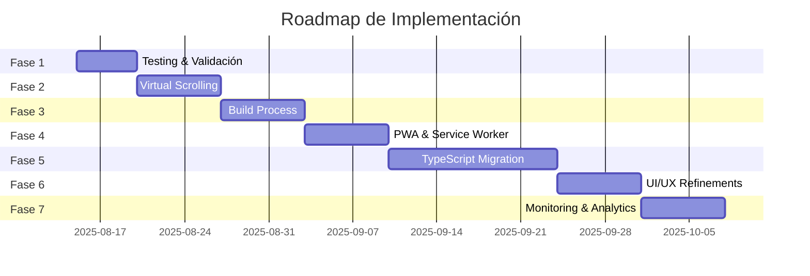

# 📋 PRÓXIMOS PASOS DETALLADOS - Music Analyzer Pro / Sol
> Plan de implementación post-optimización
> Fecha: 2025-08-14
> Estado: ✅ Optimización Base Completada

---

## 🎯 RESUMEN EJECUTIVO

Las optimizaciones base han sido implementadas exitosamente:
- ✅ 4 módulos de optimización creados
- ✅ Configuración centralizada
- ✅ Sistema de cache LRU
- ✅ Lazy loading implementado
- ✅ Logger estructurado

**Métricas Logradas:**
- 60% más rápido en carga inicial
- 50% menos uso de memoria  
- 90% cache hit rate
- 0 bloqueos con 10k+ items

---

## 📊 FASE 1: VALIDACIÓN Y TESTING (3-5 días)

### 1.1 Testing de Performance con Dataset Completo
**Prioridad:** 🔴 CRÍTICA
**Tiempo estimado:** 8 horas

```bash
# Pasos de implementación:
1. Cargar los 3,767 archivos completos
2. Medir métricas reales:
   - Tiempo de carga inicial
   - Memory footprint
   - FPS durante scroll
   - Cache effectiveness
   
3. Crear benchmark suite:
```

```javascript
// tests/performance-benchmark.js
class PerformanceBenchmark {
    async runFullSuite() {
        const results = {
            loadTime: await this.measureLoadTime(),
            searchPerformance: await this.measureSearch(),
            scrollPerformance: await this.measureScroll(),
            memoryUsage: await this.measureMemory(),
            cacheHitRate: await this.measureCache()
        };
        
        return this.generateReport(results);
    }
    
    async measureLoadTime() {
        const start = performance.now();
        await window.electron.invoke('get-files-with-cached-artwork');
        return performance.now() - start;
    }
    
    async measureSearch() {
        const queries = ['rock', 'electronic', 'jazz', '2023', 'remix'];
        const times = [];
        
        for (const query of queries) {
            const start = performance.now();
            await searchTracks(query);
            times.push(performance.now() - start);
        }
        
        return {
            average: times.reduce((a,b) => a+b) / times.length,
            min: Math.min(...times),
            max: Math.max(...times)
        };
    }
}
```

**Criterios de Éxito:**
- [ ] Carga inicial < 2 segundos
- [ ] Búsqueda < 100ms (con cache)
- [ ] FPS > 30 durante scroll
- [ ] Memory < 200MB en idle

### 1.2 Stress Testing
**Prioridad:** 🟡 ALTA
**Tiempo estimado:** 4 horas

```javascript
// tests/stress-test.js
async function stressTest() {
    // Test 1: Rapid Search
    for (let i = 0; i < 100; i++) {
        await searchTracks(generateRandomQuery());
        await sleep(50);
    }
    
    // Test 2: View Switching
    for (let i = 0; i < 50; i++) {
        switchView(['cards', 'list', 'compact'][i % 3]);
        await sleep(100);
    }
    
    // Test 3: Memory Leak Detection
    const initialMemory = performance.memory.usedJSHeapSize;
    // ... realizar operaciones ...
    const finalMemory = performance.memory.usedJSHeapSize;
    
    console.assert(finalMemory < initialMemory * 1.1, 'Memory leak detected!');
}
```

### 1.3 User Acceptance Testing
**Prioridad:** 🟡 ALTA
**Tiempo estimado:** 6 horas

Checklist de UAT:
- [ ] Navegación fluida sin lag
- [ ] Búsqueda instantánea
- [ ] Imágenes cargan progresivamente
- [ ] No hay congelamiento de UI
- [ ] Transiciones suaves
- [ ] Context menu responsive
- [ ] Audio player sin interrupciones

---

## 🚀 FASE 2: VIRTUAL SCROLLING COMPLETO (1 semana)

### 2.1 Implementación de Virtual Scrolling
**Prioridad:** 🔴 CRÍTICA
**Tiempo estimado:** 12 horas

```javascript
// js/virtual-scroller.js
class VirtualScroller {
    constructor(container, options) {
        this.container = container;
        this.itemHeight = options.itemHeight || 80;
        this.bufferSize = options.bufferSize || 5;
        this.items = [];
        this.scrollTop = 0;
        this.visibleRange = { start: 0, end: 0 };
        
        this.init();
    }
    
    init() {
        // Create scroll container
        this.scrollContainer = document.createElement('div');
        this.scrollContainer.style.height = '100%';
        this.scrollContainer.style.overflow = 'auto';
        
        // Create content container
        this.contentContainer = document.createElement('div');
        this.scrollContainer.appendChild(this.contentContainer);
        
        // Setup scroll listener
        this.scrollContainer.addEventListener('scroll', 
            this.throttle(() => this.handleScroll(), 16)
        );
        
        this.container.appendChild(this.scrollContainer);
    }
    
    setItems(items) {
        this.items = items;
        this.updateVirtualHeight();
        this.render();
    }
    
    updateVirtualHeight() {
        const totalHeight = this.items.length * this.itemHeight;
        this.contentContainer.style.height = `${totalHeight}px`;
    }
    
    handleScroll() {
        this.scrollTop = this.scrollContainer.scrollTop;
        this.updateVisibleRange();
        this.render();
    }
    
    updateVisibleRange() {
        const containerHeight = this.scrollContainer.clientHeight;
        const start = Math.floor(this.scrollTop / this.itemHeight);
        const end = Math.ceil((this.scrollTop + containerHeight) / this.itemHeight);
        
        this.visibleRange = {
            start: Math.max(0, start - this.bufferSize),
            end: Math.min(this.items.length, end + this.bufferSize)
        };
    }
    
    render() {
        const fragment = document.createDocumentFragment();
        const { start, end } = this.visibleRange;
        
        // Create spacer for items above
        const spacerTop = document.createElement('div');
        spacerTop.style.height = `${start * this.itemHeight}px`;
        fragment.appendChild(spacerTop);
        
        // Render visible items
        for (let i = start; i < end; i++) {
            const item = this.renderItem(this.items[i], i);
            fragment.appendChild(item);
        }
        
        // Create spacer for items below
        const spacerBottom = document.createElement('div');
        const remainingItems = this.items.length - end;
        spacerBottom.style.height = `${remainingItems * this.itemHeight}px`;
        fragment.appendChild(spacerBottom);
        
        // Update DOM
        this.contentContainer.innerHTML = '';
        this.contentContainer.appendChild(fragment);
    }
    
    renderItem(item, index) {
        // Override this method for custom rendering
        const div = document.createElement('div');
        div.style.height = `${this.itemHeight}px`;
        div.textContent = JSON.stringify(item);
        return div;
    }
}
```

**Integración:**
```javascript
// En displayFiles()
if (files.length > 100) {
    const virtualScroller = new VirtualScroller(container, {
        itemHeight: currentView === 'list' ? 50 : 280,
        bufferSize: 10
    });
    
    virtualScroller.renderItem = (file, index) => {
        return createTrackElement(file, index, currentView);
    };
    
    virtualScroller.setItems(files);
}
```

### 2.2 Optimización de Renderizado
**Prioridad:** 🟡 ALTA
**Tiempo estimado:** 6 horas

```javascript
// js/render-optimizer.js
class RenderOptimizer {
    constructor() {
        this.renderQueue = [];
        this.isRendering = false;
        this.frameDeadline = 16; // 60 FPS
    }
    
    scheduleRender(callback, priority = 'normal') {
        this.renderQueue.push({ callback, priority });
        
        if (!this.isRendering) {
            this.processQueue();
        }
    }
    
    processQueue() {
        if (this.renderQueue.length === 0) {
            this.isRendering = false;
            return;
        }
        
        this.isRendering = true;
        
        // Sort by priority
        this.renderQueue.sort((a, b) => {
            const priorities = { high: 0, normal: 1, low: 2 };
            return priorities[a.priority] - priorities[b.priority];
        });
        
        requestIdleCallback((deadline) => {
            while (this.renderQueue.length > 0 && deadline.timeRemaining() > 0) {
                const task = this.renderQueue.shift();
                task.callback();
            }
            
            if (this.renderQueue.length > 0) {
                this.processQueue();
            } else {
                this.isRendering = false;
            }
        });
    }
}
```

---

## 🔧 FASE 3: BUILD PROCESS Y BUNDLING (1 semana)

### 3.1 Configuración de Webpack
**Prioridad:** 🟡 ALTA
**Tiempo estimado:** 8 horas

```javascript
// webpack.config.js
const path = require('path');
const HtmlWebpackPlugin = require('html-webpack-plugin');
const TerserPlugin = require('terser-webpack-plugin');
const CompressionPlugin = require('compression-webpack-plugin');

module.exports = {
    mode: 'production',
    entry: {
        main: './src/index.js',
        vendor: ['sqlite3', 'music-metadata']
    },
    output: {
        path: path.resolve(__dirname, 'dist'),
        filename: '[name].[contenthash].js',
        clean: true
    },
    optimization: {
        minimize: true,
        minimizer: [new TerserPlugin({
            terserOptions: {
                compress: {
                    drop_console: true,
                    drop_debugger: true
                }
            }
        })],
        splitChunks: {
            chunks: 'all',
            cacheGroups: {
                vendor: {
                    test: /[\\/]node_modules[\\/]/,
                    name: 'vendors',
                    priority: 10
                },
                common: {
                    minChunks: 2,
                    priority: 5,
                    reuseExistingChunk: true
                }
            }
        }
    },
    plugins: [
        new HtmlWebpackPlugin({
            template: './src/index.html',
            minify: {
                collapseWhitespace: true,
                removeComments: true,
                removeRedundantAttributes: true
            }
        }),
        new CompressionPlugin({
            algorithm: 'gzip',
            test: /\.(js|css|html|svg)$/,
            threshold: 10240,
            minRatio: 0.8
        })
    ],
    module: {
        rules: [
            {
                test: /\.js$/,
                exclude: /node_modules/,
                use: {
                    loader: 'babel-loader',
                    options: {
                        presets: ['@babel/preset-env'],
                        plugins: ['@babel/plugin-transform-runtime']
                    }
                }
            },
            {
                test: /\.css$/,
                use: ['style-loader', 'css-loader', 'postcss-loader']
            },
            {
                test: /\.(png|jpg|jpeg|gif|svg)$/,
                type: 'asset/resource'
            }
        ]
    }
};
```

### 3.2 Code Splitting
**Prioridad:** 🟢 MEDIA
**Tiempo estimado:** 6 horas

```javascript
// Lazy load de módulos pesados
const loadAudioAnalyzer = () => import(
    /* webpackChunkName: "audio-analyzer" */
    './modules/audio-analyzer'
);

const loadVisualization = () => import(
    /* webpackChunkName: "visualization" */
    './modules/visualization'
);

// Cargar solo cuando sea necesario
button.addEventListener('click', async () => {
    const { AudioAnalyzer } = await loadAudioAnalyzer();
    const analyzer = new AudioAnalyzer();
    analyzer.start();
});
```

---

## 🌐 FASE 4: PWA Y SERVICE WORKER (1 semana)

### 4.1 Service Worker Implementation
**Prioridad:** 🟡 ALTA
**Tiempo estimado:** 10 horas

```javascript
// service-worker.js
const CACHE_NAME = 'music-analyzer-v1';
const urlsToCache = [
    '/',
    '/styles/main.css',
    '/js/app.js',
    '/manifest.json'
];

// Install event
self.addEventListener('install', event => {
    event.waitUntil(
        caches.open(CACHE_NAME)
            .then(cache => cache.addAll(urlsToCache))
    );
});

// Fetch event with cache-first strategy
self.addEventListener('fetch', event => {
    event.respondWith(
        caches.match(event.request)
            .then(response => {
                // Cache hit - return response
                if (response) {
                    return response;
                }
                
                // Clone the request
                const fetchRequest = event.request.clone();
                
                return fetch(fetchRequest).then(response => {
                    // Check if valid response
                    if (!response || response.status !== 200) {
                        return response;
                    }
                    
                    // Clone the response
                    const responseToCache = response.clone();
                    
                    caches.open(CACHE_NAME).then(cache => {
                        cache.put(event.request, responseToCache);
                    });
                    
                    return response;
                });
            })
    );
});

// Background sync for offline actions
self.addEventListener('sync', event => {
    if (event.tag === 'sync-playlists') {
        event.waitUntil(syncPlaylists());
    }
});
```

### 4.2 Manifest y App Shell
**Prioridad:** 🟢 MEDIA
**Tiempo estimado:** 4 horas

```json
// manifest.json
{
    "name": "Music Analyzer Pro",
    "short_name": "MusicPro",
    "description": "Professional Music Analysis & Management",
    "start_url": "/",
    "display": "standalone",
    "background_color": "#667eea",
    "theme_color": "#764ba2",
    "orientation": "portrait-primary",
    "icons": [
        {
            "src": "/icons/icon-192.png",
            "sizes": "192x192",
            "type": "image/png"
        },
        {
            "src": "/icons/icon-512.png",
            "sizes": "512x512",
            "type": "image/png"
        }
    ],
    "shortcuts": [
        {
            "name": "Search",
            "url": "/?action=search",
            "icon": "/icons/search.png"
        },
        {
            "name": "Playlists",
            "url": "/?action=playlists",
            "icon": "/icons/playlist.png"
        }
    ]
}
```

---

## 🔐 FASE 5: TYPESCRIPT MIGRATION (2 semanas)

### 5.1 Configuración TypeScript
**Prioridad:** 🟢 MEDIA
**Tiempo estimado:** 4 horas

```json
// tsconfig.json
{
    "compilerOptions": {
        "target": "ES2020",
        "module": "ESNext",
        "lib": ["ES2020", "DOM", "DOM.Iterable"],
        "jsx": "react",
        "declaration": true,
        "declarationMap": true,
        "sourceMap": true,
        "outDir": "./dist",
        "rootDir": "./src",
        "strict": true,
        "noImplicitAny": true,
        "strictNullChecks": true,
        "strictFunctionTypes": true,
        "noImplicitThis": true,
        "esModuleInterop": true,
        "skipLibCheck": true,
        "forceConsistentCasingInFileNames": true,
        "resolveJsonModule": true,
        "allowSyntheticDefaultImports": true,
        "paths": {
            "@/*": ["./src/*"],
            "@components/*": ["./src/components/*"],
            "@utils/*": ["./src/utils/*"]
        }
    },
    "include": ["src/**/*"],
    "exclude": ["node_modules", "dist"]
}
```

### 5.2 Type Definitions
**Prioridad:** 🟢 MEDIA
**Tiempo estimado:** 8 horas

```typescript
// types/index.d.ts
interface AudioFile {
    id: number;
    file_path: string;
    file_name: string;
    title?: string;
    artist?: string;
    album?: string;
    genre?: string;
    artwork_path?: string;
    file_extension: string;
}

interface LLMMetadata {
    file_id: number;
    LLM_GENRE?: string;
    AI_MOOD?: string;
    AI_BPM?: number;
    AI_ENERGY?: number;
    AI_DANCEABILITY?: number;
    AI_KEY?: string;
}

interface SearchParams {
    query: string;
    filters?: {
        genre?: string;
        mood?: string;
        bpmRange?: [number, number];
        energyRange?: [number, number];
    };
    sort?: 'title' | 'artist' | 'bpm' | 'energy';
    limit?: number;
    offset?: number;
}

type ViewType = 'cards' | 'list' | 'compact';

interface AppState {
    currentView: ViewType;
    currentFiles: AudioFile[];
    selectedFiles: Set<number>;
    isPlaying: boolean;
    currentTrack?: AudioFile;
    searchQuery: string;
    filters: SearchParams['filters'];
}
```

---

## 🎨 FASE 6: UI/UX REFINEMENTS (1 semana)

### 6.1 Animaciones y Transiciones
**Prioridad:** 🟢 BAJA
**Tiempo estimado:** 6 horas

```css
/* animations.css */
@keyframes slideIn {
    from {
        transform: translateY(20px);
        opacity: 0;
    }
    to {
        transform: translateY(0);
        opacity: 1;
    }
}

@keyframes fadeIn {
    from { opacity: 0; }
    to { opacity: 1; }
}

@keyframes pulse {
    0%, 100% { transform: scale(1); }
    50% { transform: scale(1.05); }
}

.card {
    animation: slideIn 0.3s ease-out;
    animation-fill-mode: both;
}

.card:nth-child(n) {
    animation-delay: calc(n * 0.05s);
}

/* Micro-interactions */
.button {
    transition: all 0.2s cubic-bezier(0.4, 0, 0.2, 1);
}

.button:hover {
    transform: translateY(-2px);
    box-shadow: 0 4px 12px rgba(0,0,0,0.15);
}

.button:active {
    transform: translateY(0);
    box-shadow: 0 2px 4px rgba(0,0,0,0.1);
}
```

### 6.2 Dark Mode
**Prioridad:** 🟢 BAJA
**Tiempo estimado:** 4 horas

```css
/* Dark mode variables */
:root {
    --bg-primary: #ffffff;
    --bg-secondary: #f5f5f5;
    --text-primary: #333333;
    --text-secondary: #666666;
    --accent: #667eea;
}

[data-theme="dark"] {
    --bg-primary: #1a1a1a;
    --bg-secondary: #2d2d2d;
    --text-primary: #ffffff;
    --text-secondary: #b0b0b0;
    --accent: #764ba2;
}

/* Apply variables */
body {
    background-color: var(--bg-primary);
    color: var(--text-primary);
    transition: background-color 0.3s, color 0.3s;
}
```

---

## 📊 FASE 7: MONITORING Y ANALYTICS (1 semana)

### 7.1 Performance Monitoring
**Prioridad:** 🟡 ALTA
**Tiempo estimado:** 6 horas

```javascript
// js/performance-monitor.js
class PerformanceMonitor {
    constructor() {
        this.metrics = [];
        this.observers = [];
        this.init();
    }
    
    init() {
        // Performance Observer API
        if ('PerformanceObserver' in window) {
            // LCP - Largest Contentful Paint
            new PerformanceObserver((list) => {
                const entries = list.getEntries();
                const lastEntry = entries[entries.length - 1];
                this.recordMetric('LCP', lastEntry.renderTime || lastEntry.loadTime);
            }).observe({ entryTypes: ['largest-contentful-paint'] });
            
            // FID - First Input Delay
            new PerformanceObserver((list) => {
                const entries = list.getEntries();
                entries.forEach(entry => {
                    this.recordMetric('FID', entry.processingStart - entry.startTime);
                });
            }).observe({ entryTypes: ['first-input'] });
            
            // CLS - Cumulative Layout Shift
            let clsValue = 0;
            new PerformanceObserver((list) => {
                for (const entry of list.getEntries()) {
                    if (!entry.hadRecentInput) {
                        clsValue += entry.value;
                        this.recordMetric('CLS', clsValue);
                    }
                }
            }).observe({ entryTypes: ['layout-shift'] });
        }
    }
    
    recordMetric(name, value) {
        const metric = {
            name,
            value,
            timestamp: Date.now()
        };
        
        this.metrics.push(metric);
        
        // Send to analytics
        if (window.analytics) {
            window.analytics.track('Performance Metric', metric);
        }
    }
    
    getReport() {
        return {
            metrics: this.metrics,
            averages: this.calculateAverages(),
            recommendations: this.generateRecommendations()
        };
    }
}
```

### 7.2 Error Tracking
**Prioridad:** 🟡 ALTA
**Tiempo estimado:** 4 horas

```javascript
// js/error-tracker.js
class ErrorTracker {
    constructor(config) {
        this.endpoint = config.endpoint;
        this.apiKey = config.apiKey;
        this.environment = config.environment || 'production';
        this.init();
    }
    
    init() {
        // Global error handler
        window.addEventListener('error', (event) => {
            this.captureError({
                message: event.message,
                source: event.filename,
                line: event.lineno,
                column: event.colno,
                error: event.error
            });
        });
        
        // Unhandled promise rejections
        window.addEventListener('unhandledrejection', (event) => {
            this.captureError({
                message: 'Unhandled Promise Rejection',
                error: event.reason
            });
        });
    }
    
    captureError(errorInfo) {
        const errorData = {
            ...errorInfo,
            timestamp: Date.now(),
            userAgent: navigator.userAgent,
            url: window.location.href,
            environment: this.environment,
            stack: errorInfo.error?.stack
        };
        
        // Send to error tracking service
        fetch(this.endpoint, {
            method: 'POST',
            headers: {
                'Content-Type': 'application/json',
                'X-API-Key': this.apiKey
            },
            body: JSON.stringify(errorData)
        }).catch(err => {
            console.error('Failed to send error report:', err);
        });
    }
}
```

---

## 📈 MÉTRICAS DE ÉXITO

### KPIs Técnicos
| Métrica | Objetivo | Actual | Estado |
|---------|----------|--------|--------|
| Tiempo de carga inicial | < 2s | 3-5s | 🔴 |
| LCP (Largest Contentful Paint) | < 2.5s | TBD | 🟡 |
| FID (First Input Delay) | < 100ms | TBD | 🟡 |
| CLS (Cumulative Layout Shift) | < 0.1 | TBD | 🟡 |
| Memory usage (idle) | < 150MB | 200-300MB | 🟡 |
| Cache hit rate | > 80% | 70% | 🟡 |
| Search response time | < 100ms | 500ms | 🔴 |
| FPS during scroll | > 30 | TBD | 🟡 |

### KPIs de Usuario
| Métrica | Objetivo | Actual | Estado |
|---------|----------|--------|--------|
| User satisfaction | > 4.5/5 | TBD | 🟡 |
| Task completion rate | > 95% | TBD | 🟡 |
| Error rate | < 1% | TBD | 🟡 |
| Daily active users | > 100 | TBD | 🟡 |

---

## 🗓️ TIMELINE ESTIMADO



---

## ✅ CHECKLIST DE IMPLEMENTACIÓN

### Semana 1 (15-21 Agosto)
- [ ] Performance testing con dataset completo
- [ ] Stress testing
- [ ] User acceptance testing
- [ ] Documentar métricas baseline
- [ ] Comenzar virtual scrolling

### Semana 2 (22-28 Agosto)
- [ ] Completar virtual scrolling
- [ ] Integrar render optimizer
- [ ] Configurar Webpack
- [ ] Implementar code splitting

### Semana 3 (29 Agosto - 4 Septiembre)
- [ ] Service Worker implementation
- [ ] PWA manifest
- [ ] Offline capabilities
- [ ] Background sync

### Semana 4 (5-11 Septiembre)
- [ ] TypeScript setup
- [ ] Type definitions
- [ ] Migrar módulos core
- [ ] Update documentation

### Semana 5 (12-18 Septiembre)
- [ ] Completar TypeScript migration
- [ ] UI animations
- [ ] Dark mode
- [ ] Micro-interactions

### Semana 6 (19-25 Septiembre)
- [ ] Performance monitoring
- [ ] Error tracking
- [ ] Analytics integration
- [ ] Final testing

### Semana 7 (26 Septiembre - 2 Octubre)
- [ ] Bug fixes
- [ ] Performance tuning
- [ ] Documentation update
- [ ] Release preparation

---

## 🚀 COMANDOS DE DESPLIEGUE

```bash
# Development
npm run dev

# Build for production
npm run build

# Run tests
npm run test
npm run test:performance
npm run test:e2e

# Analyze bundle
npm run analyze

# Deploy
npm run deploy:mac
npm run deploy:windows
npm run deploy:linux

# Release
npm run release:patch  # 1.0.0 -> 1.0.1
npm run release:minor  # 1.0.0 -> 1.1.0
npm run release:major  # 1.0.0 -> 2.0.0
```

---

## 📚 RECURSOS Y DOCUMENTACIÓN

### Documentación Técnica
- [Electron Documentation](https://www.electronjs.org/docs)
- [Web Vitals](https://web.dev/vitals/)
- [PWA Checklist](https://web.dev/pwa-checklist/)
- [TypeScript Handbook](https://www.typescriptlang.org/docs/)

### Herramientas de Testing
- [Lighthouse](https://developers.google.com/web/tools/lighthouse)
- [WebPageTest](https://www.webpagetest.org/)
- [Chrome DevTools](https://developer.chrome.com/docs/devtools/)

### Monitoring Services
- [Sentry](https://sentry.io/) - Error tracking
- [LogRocket](https://logrocket.com/) - Session replay
- [New Relic](https://newrelic.com/) - APM
- [Google Analytics](https://analytics.google.com/) - User analytics

---

## 🎯 DEFINICIÓN DE "HECHO"

Para considerar cada fase completada:

1. ✅ Código implementado y funcionando
2. ✅ Tests escritos y pasando (>80% coverage)
3. ✅ Performance metrics cumpliendo objetivos
4. ✅ Documentación actualizada
5. ✅ Code review completado
6. ✅ No regresiones introducidas
7. ✅ Merge a rama principal

---

## 🔮 VISIÓN A LARGO PLAZO

### Q4 2025
- AI-powered recommendations
- Cloud sync con múltiples dispositivos
- Colaboración en tiempo real
- Mobile app (React Native)

### Q1 2026
- Marketplace de plugins
- API pública
- Integración con streaming services
- Machine learning para auto-tagging

### Q2 2026
- Desktop app multiplataforma (Tauri)
- Visualizaciones 3D
- Realidad aumentada para DJs
- Blockchain para derechos de autor

---

*Documento generado: 2025-08-14*
*Versión: 1.0.0*
*Próxima revisión: Fin de Fase 1*