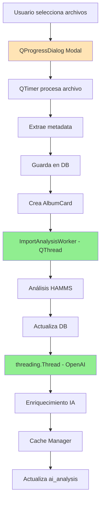

# 🔄 ESTADO DEL THREADING Y OPERACIONES ASÍNCRONAS

## ✅ OPERACIONES QUE YA USAN THREADING (No bloquean UI)

### 1. **Importación de Archivos** ✅
- **Ubicación**: `music_player.py:1548-1621`
- **Implementación**: 
  - `QProgressDialog` con procesamiento incremental
  - `QTimer.singleShot(0)` para procesar archivos uno por uno
  - UI permanece responsiva durante importación masiva

### 2. **Análisis HAMMS (Background)** ✅
- **Clase**: `ImportAnalysisWorker(QThread)` 
- **Ubicación**: `music_player.py:59-86`
- **Proceso**:
  - Se ejecuta en thread separado después de guardar en DB
  - Análisis de BPM, Key, Energy
  - No bloquea la UI durante análisis
  - Actualiza badges de cards al terminar

### 3. **Análisis Batch (Missing Features)** ✅
- **Clase**: `BatchAnalysisWorker(QThread)`
- **Ubicación**: `music_player.py:89-109`
- **Características**:
  - Análisis masivo de tracks sin BPM/Key
  - Señales de progreso para actualizar UI
  - Cancelable con `request_cancel()`

### 4. **Análisis de Loudness (Batch)** ✅
- **Clase**: `LoudnessWorker(QThread)`
- **Ubicación**: `music_player.py:1939-1954`
- **Proceso**:
  - Análisis LUFS en background
  - QProgressDialog modal
  - No bloquea UI principal

### 5. **Enriquecimiento con OpenAI** ✅
- **Implementación**: `threading.Thread`
- **Ubicación**: `music_player.py:2108-2154`
- **Características**:
  - Thread daemon para no bloquear cierre
  - Se ejecuta DESPUÉS del análisis HAMMS
  - Con cache para optimizar llamadas

### 6. **Database Writer (Single Thread)** ✅
- **Clase**: `DatabaseWriter`
- **Ubicación**: `src/utils/db_writer.py`
- **Patrón**: Single writer con cola
- **Evita**: Bloqueos de SQLite por escrituras concurrentes

## 🔴 OPERACIONES QUE PODRÍAN BLOQUEAR UI

### 1. **Reproducción de Audio**
- **Estado**: Usa `QMediaPlayer` (asíncrono por defecto)
- **Riesgo**: Mínimo, Qt maneja internamente

### 2. **Carga Inicial de Biblioteca**
- **Ubicación**: `load_library()`
- **Estado actual**: Carga todos los tracks de golpe
- **Impacto**: Puede tardar con bibliotecas grandes (>1000 tracks)
- **Solución propuesta**: Lazy loading o paginación

### 3. **Búsqueda y Filtrado**
- **Estado**: Se ejecuta en UI thread
- **Impacto**: Mínimo con <5000 tracks
- **Podría optimizarse**: Con búsqueda diferida

### 4. **Actualización de VU Meter**
- **Estado**: Timer cada 33ms
- **Optimizado**: Solo actualiza si hay cambios

## 📊 FLUJO DE IMPORTACIÓN COMPLETO



## 🎯 OPERACIONES NO BLOQUEANTES CONFIRMADAS

| Operación | Método | Thread | Bloquea UI |
|-----------|--------|--------|------------|
| Import Files | QTimer.singleShot | Main (async) | ❌ No |
| HAMMS Analysis | QThread | Worker | ❌ No |
| OpenAI Enrichment | threading.Thread | Daemon | ❌ No |
| Batch Analysis | QThread | Worker | ❌ No |
| Loudness Analysis | QThread | Worker | ❌ No |
| DB Writes | Queue + Thread | Writer | ❌ No |
| Audio Playback | QMediaPlayer | Qt Internal | ❌ No |
| VU Meter | QTimer | Main | ❌ No* |

*No bloquea pero consume recursos

## ⚡ OPTIMIZACIONES IMPLEMENTADAS

### 1. **Análisis Paralelo**
- HAMMS y OpenAI se ejecutan en paralelo
- No esperan uno al otro

### 2. **Cache de OpenAI**
- Evita llamadas repetidas a la API
- SQLite cache con TTL 24h

### 3. **Status Badges**
- Cards muestran "Queued" → "Analyzing…" → Completado
- Usuario ve progreso sin bloqueos

### 4. **Single DB Writer**
- Evita "database is locked" errors
- Cola de escrituras procesadas secuencialmente

## 🚀 MEJORAS POTENCIALES

### 1. **Lazy Loading de Biblioteca**
```python
# Cargar primeros 100 tracks
# Cargar resto en background o con scroll
```

### 2. **Worker Pool para Análisis**
```python
# En lugar de threads individuales
# Pool de workers reutilizables
```

### 3. **Análisis Incremental**
```python
# Mostrar resultados parciales
# BPM primero, luego Key, luego IA
```

## ✅ CONCLUSIÓN

**La aplicación NO BLOQUEA la UI durante operaciones pesadas:**

- ✅ Importación usa QTimer (no blocking)
- ✅ Análisis HAMMS usa QThread
- ✅ OpenAI usa threading.Thread daemon
- ✅ Batch operations usan QThread
- ✅ DB writes usan queue + thread

**Estado: OPTIMIZADO para responsividad**