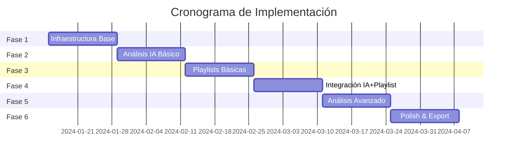

# Plan de Implementación - Music Analyzer Pro
## Integración de IA y Sistema de Playlists Inteligentes

### 📋 Resumen Ejecutivo

Este documento define el plan de implementación para las dos prioridades principales del proyecto:
1. **Integración de IA** en el flujo de análisis de audio
2. **Sistema de Generación Inteligente de Playlists** (HAMMS + IA)

**Objetivo**: Transformar Music Analyzer Pro en una herramienta inteligente de preparación de sets para DJs profesionales.

---

## 1. Contexto del Proyecto

### 1.1 Usuario Principal
- **Perfil**: DJ profesional
- **Biblioteca**: 5,000-20,000 tracks
- **Sistema**: macOS (principal), Windows (secundario)
- **Workflow actual**: Mixed In Key → Análisis HAMMS → Preparación manual de sets

### 1.2 Problemas a Resolver
- Análisis incompleto (falta contexto, mood, género detallado)
- Preparación manual de playlists consume mucho tiempo
- No hay inteligencia en las sugerencias de mezcla
- Falta de aprendizaje de preferencias del usuario

### 1.3 Solución Propuesta
- **IA Post-Importación**: Análisis contextual profundo de cada track
- **Playlists Inteligentes**: Generación automática basada en HAMMS + IA
- **Machine Learning**: Aprendizaje continuo de preferencias

---

## 2. Arquitectura Técnica

### 2.1 Flujo de Datos Mejorado

```
┌──────────────────────────────────────────────────────────┐
│                    FLUJO COMPLETO                        │
├──────────────────────────────────────────────────────────┤
│                                                           │
│  1. IMPORTACIÓN                                          │
│     ↓                                                    │
│  2. EXTRACCIÓN METADATA (Mixed In Key tags)             │
│     ↓                                                    │
│  3. ANÁLISIS HAMMS (Key, BPM, Energy)                   │
│     ↓                                                    │
│  4. ANÁLISIS IA (Género, Mood, Estructura) ← NUEVO      │
│     ↓                                                    │
│  5. CONSOLIDACIÓN EN DB                                  │
│     ↓                                                    │
│  6. GENERACIÓN PLAYLISTS INTELIGENTES ← NUEVO           │
│     ↓                                                    │
│  7. EXPORTACIÓN (M3U, Rekordbox XML, etc.)              │
│                                                           │
└──────────────────────────────────────────────────────────┘
```

### 2.2 Componentes Nuevos a Desarrollar

#### 2.2.1 Módulo de Análisis IA
```python
src/
├── ai_analysis/
│   ├── __init__.py
│   ├── ai_analyzer.py          # Orquestador principal
│   ├── genre_classifier.py     # Clasificación de género/subgénero
│   ├── mood_analyzer.py        # Análisis de mood y energía
│   ├── structure_detector.py   # Detección de estructura musical
│   ├── lyrics_analyzer.py      # Análisis de contexto lírico
│   ├── similarity_engine.py    # Motor de similitud
│   └── models/                 # Modelos pre-entrenados
│       ├── genre_model.pkl
│       ├── mood_model.pkl
│       └── structure_model.pkl
```

#### 2.2.2 Módulo de Playlists Inteligentes
```python
src/
├── playlist_generation/
│   ├── __init__.py
│   ├── playlist_generator.py   # Generador principal
│   ├── harmonic_engine.py      # Motor armónico (HAMMS)
│   ├── ai_engine.py            # Motor de IA
│   ├── hybrid_engine.py        # Combinación HAMMS+IA
│   ├── templates.py            # Templates predefinidos
│   ├── learning.py             # ML para mejora continua
│   └── export/
│       ├── m3u_exporter.py
│       ├── rekordbox_exporter.py
│       └── serato_exporter.py
```

### 2.3 Modificaciones a Componentes Existentes

#### 2.3.1 Base de Datos (src/database.py)
```sql
-- Nuevas tablas necesarias
CREATE TABLE ai_analysis (
    track_id INTEGER PRIMARY KEY,
    genre VARCHAR(100),
    subgenre VARCHAR(100),
    mood VARCHAR(100),
    energy_profile TEXT,
    structure TEXT,
    lyrics_context TEXT,
    similar_tracks TEXT,
    analysis_date TIMESTAMP,
    ai_version VARCHAR(20),
    FOREIGN KEY (track_id) REFERENCES tracks(id)
);

CREATE TABLE playlists (
    id INTEGER PRIMARY KEY AUTOINCREMENT,
    name VARCHAR(255),
    type VARCHAR(50),
    duration_minutes INTEGER,
    track_count INTEGER,
    generation_method VARCHAR(50),
    parameters TEXT,
    created_date TIMESTAMP,
    modified_date TIMESTAMP
);

CREATE TABLE playlist_tracks (
    playlist_id INTEGER,
    track_id INTEGER,
    position INTEGER,
    transition_score FLOAT,
    FOREIGN KEY (playlist_id) REFERENCES playlists(id),
    FOREIGN KEY (track_id) REFERENCES tracks(id)
);

CREATE TABLE user_preferences (
    id INTEGER PRIMARY KEY,
    preference_type VARCHAR(50),
    preference_data TEXT,
    updated_date TIMESTAMP
);
```

#### 2.3.2 UI Principal (src/main.py, src/app.py)
- Agregar tab "AI Analysis" 
- Agregar tab "Smart Playlists"
- Nuevo botón "Generate Playlist" en toolbar
- Panel de visualización de análisis IA

---

## 3. Plan de Implementación por Fases

### FASE 1: Infraestructura Base (Semana 1-2)

#### Objetivos:
- Preparar la arquitectura para IA
- Actualizar base de datos
- Crear estructura de directorios

#### Tareas:
```markdown
- [ ] Crear estructura de directorios para módulos IA
- [ ] Actualizar schema de base de datos
- [ ] Implementar clase base AIAnalyzer
- [ ] Crear sistema de configuración para IA
- [ ] Añadir logging específico para IA
- [ ] Tests unitarios para nueva estructura
```

#### Entregables:
- Estructura de proyecto actualizada
- Base de datos migrada
- Tests pasando

### FASE 2: Análisis IA Básico (Semana 3-4)

#### Objetivos:
- Implementar análisis de género y mood
- Integrar con flujo de importación
- UI para visualizar resultados

#### Tareas:
```markdown
- [ ] Implementar genre_classifier.py
- [ ] Implementar mood_analyzer.py
- [ ] Integrar IA en flujo post-HAMMS
- [ ] Crear UI para mostrar análisis IA
- [ ] Implementar caché de resultados
- [ ] Barra de progreso para análisis IA
- [ ] Tests de integración
```

#### Código ejemplo:
```python
class AIAnalyzer:
    def __init__(self):
        self.genre_classifier = GenreClassifier()
        self.mood_analyzer = MoodAnalyzer()
        
    async def analyze_track(self, audio_path, existing_metadata):
        """Análisis completo con IA"""
        
        # Mostrar progreso
        self.update_progress("Analyzing genre...", 0)
        genre_result = await self.genre_classifier.classify(audio_path)
        
        self.update_progress("Analyzing mood...", 50)
        mood_result = await self.mood_analyzer.analyze(audio_path)
        
        self.update_progress("Consolidating results...", 90)
        
        return {
            'genre': genre_result,
            'mood': mood_result,
            'timestamp': datetime.now()
        }
```

#### Entregables:
- Análisis de género funcionando
- Análisis de mood funcionando
- UI actualizada con resultados IA

### FASE 3: Generación Básica de Playlists (Semana 5-6)

#### Objetivos:
- Implementar generador de playlists armónicas
- Templates básicos
- Exportación M3U

#### Tareas:
```markdown
- [ ] Implementar playlist_generator.py
- [ ] Crear harmonic_engine.py con reglas Camelot
- [ ] Implementar 3 templates básicos (warm-up, peak, closing)
- [ ] UI wizard para crear playlists
- [ ] Exportador M3U
- [ ] Visualización de playlist generada
- [ ] Tests de playlists
```

#### Código ejemplo:
```python
class PlaylistGenerator:
    def generate_harmonic_playlist(self, start_track, duration_minutes):
        """Genera playlist armónicamente compatible"""
        
        playlist = []
        current_track = start_track
        total_duration = 0
        
        while total_duration < duration_minutes * 60:
            playlist.append(current_track)
            total_duration += current_track.duration
            
            # Buscar siguiente track compatible
            candidates = self.find_harmonic_matches(current_track)
            
            if not candidates:
                break
                
            current_track = self.select_best_candidate(candidates)
            
        return playlist
```

#### Entregables:
- Generador de playlists funcional
- 3 templates implementados
- Export M3U funcionando

### FASE 4: Integración IA + Playlists (Semana 7-8)

#### Objetivos:
- Combinar análisis IA con generación de playlists
- Sistema híbrido HAMMS + IA
- Machine Learning básico

#### Tareas:
```markdown
- [ ] Implementar hybrid_engine.py
- [ ] Sistema de scoring multi-criterio
- [ ] Análisis de estructura musical
- [ ] Detección de puntos de mezcla
- [ ] Learning básico de preferencias
- [ ] UI para ajustar balance HAMMS/IA
- [ ] Tests de integración completos
```

#### Entregables:
- Playlists híbridas funcionando
- UI de configuración
- Sistema aprendiendo de ediciones

### FASE 5: Análisis Avanzado (Semana 9-10)

#### Objetivos:
- Análisis lírico y contexto
- Similitud avanzada
- Clustering de biblioteca

#### Tareas:
```markdown
- [ ] Implementar lyrics_analyzer.py
- [ ] Motor de similitud avanzado
- [ ] Clustering automático de biblioteca
- [ ] Análisis de calidad técnica
- [ ] Detección de duplicados inteligente
- [ ] UI para explorar clusters
```

#### Entregables:
- Análisis completo de 8 categorías
- Biblioteca auto-organizada
- Sugerencias inteligentes

### FASE 6: Exportación y Polish (Semana 11-12)

#### Objetivos:
- Exportar a todos los formatos
- Optimización de performance
- Pulir UI/UX

#### Tareas:
```markdown
- [ ] Exportador Rekordbox XML
- [ ] Exportador Serato
- [ ] Compartir playlists (QR, links)
- [ ] Analytics dashboard
- [ ] Optimización con 2 cores
- [ ] Documentación usuario
- [ ] Videos tutoriales
```

#### Entregables:
- Todos los exportadores funcionando
- Performance optimizada
- Documentación completa

---

## 4. Configuración Técnica

### 4.1 Dependencias Nuevas

```python
# requirements.txt additions
torch>=2.0.0           # Para modelos de deep learning
scikit-learn>=1.3.0    # Para ML clásico
librosa>=0.10.0        # Para análisis de audio avanzado
spacy>=3.6.0           # Para análisis de texto/lyrics
pandas>=2.0.0          # Para manejo de datos
numpy>=1.24.0          # Computación numérica
joblib>=1.3.0          # Paralelización (2 cores)
```

### 4.2 Configuración de IA

```yaml
# config_ai.yaml
ai_analysis:
  enabled: true
  models_path: "./models"
  cache_results: true
  
  genre_classification:
    model: "genre_model_v1.pkl"
    confidence_threshold: 0.7
    
  mood_analysis:
    model: "mood_model_v1.pkl"
    energy_buckets: 10
    
  parallel_processing:
    enabled: true
    max_cores: 2
    batch_size: 10
    
playlist_generation:
  default_duration: 60
  default_type: "hybrid"
  
  harmonic_weight: 0.6
  ai_weight: 0.4
  
  templates:
    - warm_up
    - peak_time
    - closing
```

### 4.3 Estructura de Caché

```python
# Cache para resultados de IA
CACHE_STRUCTURE = {
    'audio_hash': 'sha256_of_audio',
    'analysis_version': '1.0',
    'genre': {
        'primary': 'Techno',
        'secondary': 'Melodic Techno',
        'confidence': 0.89
    },
    'mood': {
        'primary': 'Dark',
        'energy': 7.5,
        'valence': 0.3
    },
    'cached_at': '2024-01-15T10:30:00Z'
}
```

---

## 5. Testing y Validación

### 5.1 Datasets de Prueba

```
test_data/
├── genres/
│   ├── techno/         # 50 tracks
│   ├── house/          # 50 tracks
│   ├── trance/         # 50 tracks
│   └── minimal/        # 50 tracks
├── edge_cases/
│   ├── silence.mp3
│   ├── white_noise.mp3
│   ├── live_recording.mp3
│   └── corrupted.mp3
└── playlists/
    ├── expected_warm_up.m3u
    ├── expected_peak.m3u
    └── expected_closing.m3u
```

### 5.2 Métricas de Éxito

| Métrica | Target | Medición |
|---------|--------|----------|
| Precisión género | >85% | Test set etiquetado |
| Precisión mood | >80% | Validación manual |
| Tiempo análisis/track | <30s | Benchmark automático |
| Playlists sin editar | >60% | Tracking de uso |
| Satisfacción transiciones | >85% | Feedback usuarios |
| Performance (5k tracks) | <2h | Test de carga |

### 5.3 Tests Automatizados

```python
# test_ai_analysis.py
def test_genre_classification():
    """Test precisión de clasificación de género"""
    analyzer = GenreClassifier()
    
    for genre in ['techno', 'house', 'trance']:
        test_files = load_test_files(genre)
        correct = 0
        
        for file in test_files:
            result = analyzer.classify(file)
            if result['primary'] == genre:
                correct += 1
                
        accuracy = correct / len(test_files)
        assert accuracy > 0.85, f"Genre {genre} accuracy {accuracy} < 0.85"

# test_playlist_generation.py  
def test_harmonic_compatibility():
    """Test que todas las transiciones son armónicamente válidas"""
    generator = PlaylistGenerator()
    playlist = generator.generate_harmonic_playlist(
        start_track=get_test_track(),
        duration_minutes=60
    )
    
    for i in range(len(playlist) - 1):
        track_a = playlist[i]
        track_b = playlist[i + 1]
        
        compatibility = calculate_harmonic_compatibility(track_a, track_b)
        assert compatibility > 0.7, f"Poor transition: {track_a} → {track_b}"
```

---

## 6. UI/UX Mockups

### 6.1 Panel de Análisis IA

```
┌─────────────────────────────────────────────────────────┐
│ Track: "Cosmic Journey - Space Explorer"                │
├─────────────────────────────────────────────────────────┤
│                                                          │
│ HAMMS Analysis           │  AI Analysis                 │
│ ─────────────            │  ───────────                 │
│ Key: 8A (Am)            │  Genre: Melodic Techno       │
│ BPM: 125                │  Subgenre: Progressive       │
│ Energy: 7.5             │  Mood: Euphoric/Uplifting    │
│                         │  Era: Modern (2020s)         │
│                         │                               │
│                         │  Structure:                   │
│                         │  [Intro][Build][Drop][Break] │
│                         │                               │
│                         │  Similar in library: 23 tracks│
│                         │  [View Similar] [Generate Set]│
│                                                          │
└─────────────────────────────────────────────────────────┘
```

### 6.2 Wizard de Generación de Playlists

```
┌─────────────────────────────────────────────────────────┐
│           Create Smart Playlist - Step 1/4              │
├─────────────────────────────────────────────────────────┤
│                                                          │
│  Select Playlist Type:                                  │
│                                                          │
│  ┌──────────┐  ┌──────────┐  ┌──────────┐             │
│  │    🎵    │  │    🎭    │  │    🔀    │             │
│  │ Harmonic │  │   Mood   │  │  Hybrid  │             │
│  │  Journey │  │  Based   │  │  Smart   │             │
│  └──────────┘  └──────────┘  └──────────┘             │
│                                                          │
│  ┌──────────┐  ┌──────────┐  ┌──────────┐             │
│  │    📈    │  │    🌅    │  │    🎯    │             │
│  │  Energy  │  │  Sunset  │  │  Custom  │             │
│  │   Wave   │  │ Session  │  │ Template │             │
│  └──────────┘  └──────────┘  └──────────┘             │
│                                                          │
│                              [Cancel] [Next →]          │
└─────────────────────────────────────────────────────────┘
```

### 6.3 Vista de Playlist Generada

```
┌─────────────────────────────────────────────────────────┐
│ Playlist: "Friday Night Peak Time" (75 min, 18 tracks) │
├─────────────────────────────────────────────────────────┤
│                                                          │
│ Energy Graph:                                           │
│ 10 ┤           ╱▔▔▔╲    ╱▔▔▔▔▔╲                      │
│  8 ┤       ╱▔▔▔     ╲__╱       ╲                     │
│  6 ┤   ╱▔▔▔                      ╲___                 │
│  4 ┤__╱                               ╲___            │
│    └────────────────────────────────────────→ Time     │
│                                                          │
│ # │ Track                    │ Key │ BPM │ Trans Score │
│ ──┼──────────────────────────┼─────┼─────┼────────────│
│ 1 │ Opening Mind - Deepness  │ 5A  │ 124 │     -      │
│ 2 │ Rising Sun - Melodic One │ 5A  │ 125 │    95%     │
│ 3 │ Energy Flow - TechMaster │ 12A │ 126 │    92%     │
│ ...                                                     │
│                                                          │
│ [▶ Preview] [✏ Edit] [💾 Save] [📤 Export]            │
└─────────────────────────────────────────────────────────┘
```

---

## 7. Riesgos y Mitigación

### 7.1 Riesgos Técnicos

| Riesgo | Probabilidad | Impacto | Mitigación |
|--------|--------------|---------|------------|
| Modelos IA lentos | Media | Alto | Usar modelos ligeros, caché agresivo |
| Precisión insuficiente | Media | Medio | Dataset de entrenamiento DJ-specific |
| Consumo de memoria | Baja | Alto | Procesamiento por batches, 2 cores max |
| Incompatibilidad formatos | Baja | Medio | ffmpeg robusto, fallbacks |

### 7.2 Riesgos de Usuario

| Riesgo | Probabilidad | Impacto | Mitigación |
|--------|--------------|---------|------------|
| Curva de aprendizaje | Media | Medio | UI intuitiva, tutoriales |
| Desconfianza en IA | Media | Alto | Transparencia, control manual |
| Expectativas irreales | Alta | Medio | Comunicar limitaciones |

---

## 8. Cronograma



---

## 9. Presupuesto Estimado

### 9.1 Recursos Humanos
- 1 Desarrollador Full Stack: 12 semanas
- Testing con 5 DJs beta: 2 semanas

### 9.2 Recursos Técnicos
- Modelos pre-entrenados: Open source
- Servidor de desarrollo: Local
- Licencias de software: PyQt6 (GPL)

### 9.3 Total
- Tiempo de desarrollo: 3 meses
- Costo: Tiempo del desarrollador

---

## 10. Conclusión y Próximos Pasos

### 10.1 Resumen
Este plan implementa las dos prioridades principales:
1. **Análisis con IA** para enriquecer metadata
2. **Playlists Inteligentes** para automatizar preparación de sets

### 10.2 Beneficios Esperados
- 70% reducción en tiempo de preparación de sets
- 85% precisión en análisis de género/mood
- 60% de playlists usables sin modificación

### 10.3 Próximas Acciones Inmediatas
1. ✅ Aprobar plan de implementación
2. ⏳ Configurar entorno de desarrollo
3. ⏳ Comenzar Fase 1: Infraestructura
4. ⏳ Reclutar DJs beta testers

### 10.4 Criterios de Éxito del Proyecto
- [ ] 5,000 tracks analizados en <2 horas
- [ ] Playlists con >85% transiciones suaves
- [ ] UI responsiva con feedback claro
- [ ] Exportación a formatos DJ standard
- [ ] 5 DJs beta satisfechos

---

## Anexos

### A. Referencias Técnicas
- [Librosa Documentation](https://librosa.org/)
- [Camelot Wheel Theory](https://mixedinkey.com/harmonic-mixing-guide/)
- [PyQt6 Documentation](https://doc.qt.io/qtforpython/)

### B. Contactos
- Product Owner: [DJ/Developer]
- Beta Testers: [Lista de DJs]

### C. Control de Versiones
- v1.0 - 2024-01-15 - Plan inicial
- v1.1 - [Fecha] - [Cambios]

---

*Documento generado para Music Analyzer Pro*
*Última actualización: 2024*
