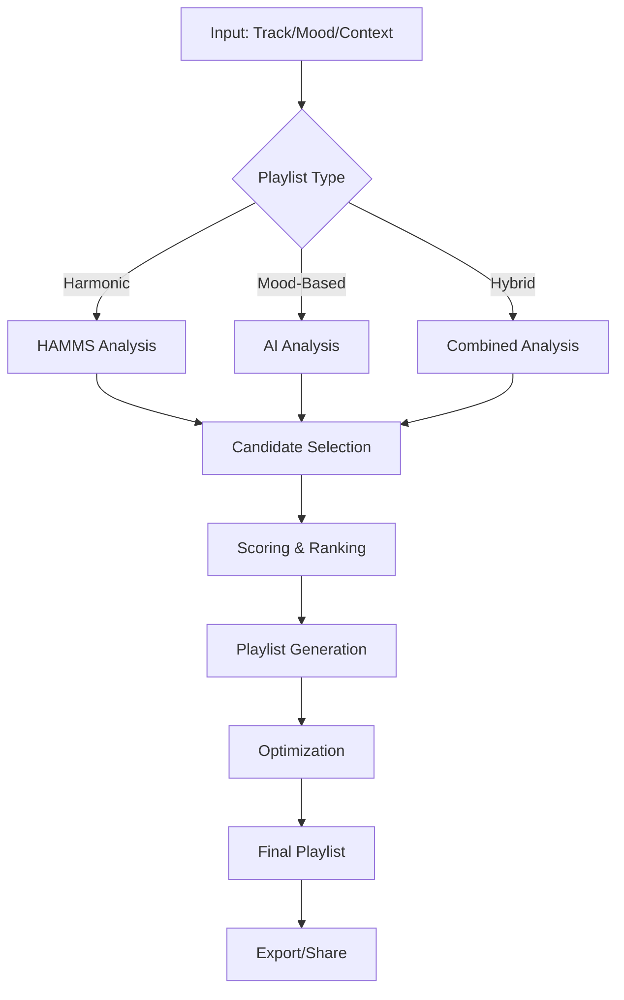

# Sistema Inteligente de Generación de Playlists - Music Analyzer Pro

## Visión General

Este documento describe el sistema de generación automática de playlists que combina el análisis armónico HAMMS con inteligencia artificial para crear sets perfectos para DJs.

## 1. Arquitectura del Sistema

### 1.1 Componentes Principales

```
┌─────────────────────────────────────────────────┐
│              PLAYLIST GENERATOR                  │
├─────────────────┬───────────────┬───────────────┤
│  HAMMS Engine   │   AI Engine   │  ML Learning  │
├─────────────────┼───────────────┼───────────────┤
│ • Key Analysis  │ • Genre Class │ • User Prefs  │
│ • BPM Matching  │ • Mood Detect │ • Edit Learn  │
│ • Camelot Wheel │ • Energy Calc │ • Skip Analysis│
│ • Harmonic Path │ • Context AI  │ • Improvement │
└─────────────────┴───────────────┴───────────────┘
```

### 1.2 Flujo de Procesamiento



## 2. Tipos de Playlists Automáticas

### 2.1 Playlists Armónicas (HAMMS-Based)

#### **Viaje Armónico Progresivo**
- **Descripción**: Sigue el círculo de quintas de Camelot
- **Ejemplo de progresión**: 
  ```
  8A (C minor) → 9A (G minor) → 4A (F minor) → 11A (B♭ minor) → 6A (E♭ minor)
  ```
- **Uso ideal**: Sets largos donde quieres explorar diferentes tonalidades

#### **Energía Ascendente Armónica**
- **Descripción**: Mantiene compatibilidad armónica mientras incrementa BPM
- **Progresión típica**:
  ```
  122 BPM/5A → 124 BPM/5A → 126 BPM/12A → 128 BPM/12A → 130 BPM/7A
  ```
- **Uso ideal**: Warm-up sets que llevan al peak time

#### **Same Key Journey**
- **Descripción**: Todas las canciones en la misma tonalidad
- **Ventajas**: Mezclas ultra-suaves, permite layering extenso
- **Desventajas**: Puede volverse monótono si es muy largo

#### **Parallel Mode Mixing**
- **Descripción**: Alterna entre mayor y menor de la misma nota
- **Ejemplo**: `8A (C minor) ↔ 8B (C major)`
- **Efecto**: Crea contraste emocional manteniendo coherencia

#### **Energy Wave Pattern**
- **Descripción**: Sube y baja energía en ondas manteniendo armonía
- **Patrón**: `Low → Medium → High → Medium → Low → Medium → High`
- **Uso**: Sets largos (2+ horas) para mantener al público enganchado

### 2.2 Playlists por Mood/Contexto (AI-Based)

#### **Opening/Warm-up Set**
```yaml
energy: 1-4 (de 10)
mood: [warm, atmospheric, groovy, building]
bpm_range: 115-124
duration: 60-90 minutos
vocals: minimal
```

#### **Peak Time Journey**
```yaml
energy: 7-10
mood: [euphoric, driving, powerful, explosive]
bpm_range: 126-132
duration: 45-60 minutos
vocals: anthems permitidos
```

#### **Sunset Session**
```yaml
energy: 4-7
mood: [melodic, emotional, golden, nostalgic]
bpm_range: 118-125
duration: 90-120 minutos
vocals: emotional/meaningful
```

#### **After Hours/Closing**
```yaml
energy: 5-8
mood: [dark, hypnotic, minimal, underground]
bpm_range: 125-130
duration: 120+ minutos
vocals: minimal/spoken word
```

### 2.3 Playlists Híbridas (HAMMS + AI)

#### **Smart Harmonic Journey**
Combina perfecta armonía con coherencia de género y mood progresivo.

#### **Emotional Arc Playlist**
Cuenta una historia emocional respetando las reglas armónicas.

#### **Genre Evolution Set**
Transición suave entre géneros manteniendo compatibilidad técnica.

## 3. Algoritmo de Generación

### 3.1 Clase Principal

```python
class SmartPlaylistGenerator:
    """
    Generador inteligente de playlists combinando HAMMS + IA
    """
    
    def __init__(self):
        self.hamms_analyzer = HAMMSAnalyzer()
        self.ai_analyzer = AIAnalyzer()
        self.graph_builder = HarmonicGraphBuilder()
        self.ml_learner = PlaylistLearner()
        self.db = DatabaseManager()
```

### 3.2 Método de Generación Principal

```python
def generate_playlist(self, 
                     start_track=None,
                     duration_minutes=60,
                     playlist_type='smart_harmonic',
                     constraints=None):
    """
    Genera playlist inteligente basada en parámetros
    
    Args:
        start_track: Track inicial (opcional)
        duration_minutes: Duración objetivo
        playlist_type: Tipo de playlist
        constraints: Restricciones adicionales
        
    Returns:
        Playlist object con tracks ordenados
    """
```

### 3.3 Búsqueda de Compatibilidad

```python
def find_compatible_tracks(self, current_track, method='hybrid'):
    """
    Encuentra tracks compatibles usando múltiples criterios
    """
    
    # HAMMS Compatibility
    harmonic_candidates = self.get_harmonic_matches(current_track)
    
    # AI Compatibility
    ai_candidates = self.get_ai_matches(current_track)
    
    # Weighted Merge
    if method == 'hybrid':
        return self.weighted_merge(
            harmonic_candidates, 
            ai_candidates,
            weights={'harmonic': 0.6, 'ai': 0.4}
        )
```

### 3.4 Sistema de Scoring Multi-Criterio

```python
def calculate_transition_score(self, track_a, track_b):
    """
    Calcula score de transición entre dos tracks
    """
    
    scores = {
        'harmonic': self.harmonic_compatibility(track_a, track_b),  # 0-1
        'energy': self.energy_flow_score(track_a, track_b),         # 0-1
        'genre': self.genre_similarity(track_a, track_b),           # 0-1
        'mood': self.mood_continuity(track_a, track_b),            # 0-1
        'surprise': self.surprise_factor(track_a, track_b)          # 0-1
    }
    
    weights = {
        'harmonic': 0.40,
        'energy': 0.20,
        'genre': 0.20,
        'mood': 0.10,
        'surprise': 0.10
    }
    
    return sum(scores[k] * weights[k] for k in scores)
```

## 4. Reglas de Compatibilidad Armónica

### 4.1 Camelot Wheel Rules

```python
CAMELOT_RULES = {
    'perfect': {
        'same_key': 0,           # 8A → 8A
        'up_fifth': +1,          # 8A → 9A
        'down_fifth': -1,        # 8A → 7A
        'relative': 'toggle'     # 8A → 8B
    },
    'good': {
        'up_whole_tone': +2,     # 8A → 10A
        'down_whole_tone': -2    # 8A → 6A
    },
    'experimental': {
        'tritone': +6/-6,        # 8A → 2A
        'semitone': +7/-5        # 8A → 3A
    }
}
```

### 4.2 BPM Compatibility

```python
BPM_RULES = {
    'strict': {
        'range': 0.03,           # ±3%
        'pitch_adjust': False
    },
    'flexible': {
        'range': 0.06,           # ±6%
        'pitch_adjust': True,
        'max_pitch': 6           # ±6% pitch
    },
    'creative': {
        'range': 0.10,           # ±10%
        'pitch_adjust': True,
        'max_pitch': 10,
        'half_time': True,       # Permite 128→64 BPM
        'double_time': True      # Permite 64→128 BPM
    }
}
```

## 5. Parámetros de Configuración

### 5.1 Parámetros HAMMS (Armónicos)

| Parámetro | Opciones | Descripción |
|-----------|----------|-------------|
| Key Compatibility | Strict / Flexible / Experimental | Qué tan estrictas son las reglas armónicas |
| BPM Range | ±3% / ±6% / ±10% / Unlimited | Rango de BPM aceptable entre tracks |
| Transition Style | Smooth / Moderate / Aggressive | Cambios de energía permitidos |
| Mix Mode | In-key / Cross-key / Energy-based | Prioridad en las transiciones |

### 5.2 Parámetros IA (Contextuales)

| Parámetro | Opciones | Descripción |
|-----------|----------|-------------|
| Genre Coherence | High / Medium / Low / Eclectic | Consistencia de género |
| Energy Progression | Linear / Waves / Random / Custom | Curva de energía |
| Mood Consistency | Maintain / Gradual / Contrast | Evolución del mood |
| Diversity | High / Medium / Low | Variedad de artistas/años |

### 5.3 Parámetros Híbridos

| Parámetro | Rango | Descripción |
|-----------|-------|-------------|
| HAMMS/AI Balance | 0-100% | Peso de cada sistema |
| Surprise Factor | 0-15% | % de tracks inesperados |
| Learning Mode | On/Off | Aprender de ediciones |
| Auto-Optimize | On/Off | Optimización post-generación |

## 6. Templates Predefinidos

### 6.1 Warm-up Set Template

```python
WARM_UP_TEMPLATE = {
    'duration': 90,
    'energy_range': (1, 5),
    'energy_progression': 'ascending_slow',
    'bpm_range': (118, 124),
    'bpm_progression': 'ascending',
    'mood': ['deep', 'atmospheric', 'groovy'],
    'genre_coherence': 'high',
    'harmonic_strictness': 'flexible',
    'vocal_percentage': 0.2,
    'surprise_factor': 0.05
}
```

### 6.2 Peak Time Template

```python
PEAK_TIME_TEMPLATE = {
    'duration': 60,
    'energy_range': (7, 10),
    'energy_progression': 'maintain_high',
    'bpm_range': (126, 132),
    'bpm_progression': 'stable',
    'mood': ['driving', 'euphoric', 'powerful'],
    'genre_coherence': 'medium',
    'harmonic_strictness': 'strict',
    'vocal_percentage': 0.4,
    'anthem_inclusion': True,
    'surprise_factor': 0.1
}
```

### 6.3 Closing Set Template

```python
CLOSING_TEMPLATE = {
    'duration': 120,
    'energy_range': (5, 8),
    'energy_progression': 'descending_waves',
    'bpm_range': (120, 128),
    'bpm_progression': 'descending_slow',
    'mood': ['emotional', 'melodic', 'nostalgic'],
    'genre_coherence': 'low',
    'harmonic_strictness': 'flexible',
    'vocal_percentage': 0.3,
    'memorable_endings': True,
    'surprise_factor': 0.08
}
```

## 7. UI/UX Design

### 7.1 Wizard de Creación (5 pasos)

#### Paso 1: Seleccionar Tipo
```
┌─────────────────────────────────────┐
│    ¿Qué tipo de playlist crear?    │
├─────────────┬───────────┬───────────┤
│  Armónica   │   Mood    │  Híbrida  │
│    📊       │    🎭     │    🔀     │
└─────────────┴───────────┴───────────┘
```

#### Paso 2: Punto de Inicio
```
┌─────────────────────────────────────┐
│     ¿Cómo empezar la playlist?     │
├─────────────┬───────────┬───────────┤
│Track Semilla│Mood/Género│  Contexto │
│     🎵      │    🎨     │    📍     │
└─────────────┴───────────┴───────────┘
```

#### Paso 3: Configuración
- Duración objetivo: [Slider: 30-240 min]
- Balance HAMMS/IA: [Slider: 0-100%]
- Factor sorpresa: [Slider: 0-15%]
- Restricciones: [Checkboxes de géneros/artistas a excluir]

#### Paso 4: Preview
Visualización en tiempo real del journey armónico y energético

#### Paso 5: Finalizar
- Nombre de playlist
- Descripción
- Tags
- Opciones de exportación

### 7.2 Visualizaciones

#### Gráfico de Energía
```
Energy
10 |      ╱╲    ╱╲
 8 |     ╱  ╲  ╱  ╲
 6 |    ╱    ╲╱    ╲
 4 |   ╱            ╲
 2 |  ╱              ╲
 0 └─────────────────────→ Time
   0    30    60    90   120 min
```

#### Mapa Armónico (Camelot Wheel)
```
        12A/B
    11A/B   1A/B
  10A/B       2A/B
 9A/B           3A/B
  8A/B       4A/B
    7A/B   5A/B
        6A/B
```

#### Timeline de Moods
```
[Atmospheric]→[Building]→[Energetic]→[Euphoric]→[Emotional]
     0-20min    20-40min   40-70min   70-90min   90-120min
```

## 8. Machine Learning Integration

### 8.1 Aprendizaje de Preferencias

```python
class PlaylistLearner:
    """
    Sistema de ML para aprender preferencias del usuario
    """
    
    def __init__(self):
        self.preference_model = PreferenceModel()
        self.transition_model = TransitionModel()
        self.feedback_processor = FeedbackProcessor()
    
    def learn_from_edits(self, original, edited):
        """
        Aprende cuando el usuario edita una playlist
        """
        changes = self.analyze_changes(original, edited)
        
        # Actualizar modelo de preferencias
        self.preference_model.update(changes)
        
        # Reentrenar modelo de transiciones
        self.transition_model.train(edited)
        
        # Guardar patrones
        self.save_learned_patterns(changes)
```

### 8.2 Análisis de Comportamiento

```python
def analyze_user_behavior(self, playlist, playback_data):
    """
    Analiza cómo el usuario interactúa con las playlists
    """
    
    metrics = {
        'skip_rate': [],        # Tracks saltados
        'repeat_rate': [],      # Tracks repetidos
        'completion_rate': [],  # Tracks completados
        'transition_rating': [] # Calidad de transiciones
    }
    
    for i, track in enumerate(playlist):
        metrics['skip_rate'].append(
            playback_data.get_skip_rate(track)
        )
        metrics['repeat_rate'].append(
            playback_data.get_repeat_rate(track)
        )
        
    return self.generate_insights(metrics)
```

### 8.3 Mejora Continua

```python
def suggest_improvements(self, playlist):
    """
    Sugiere mejoras basadas en aprendizaje
    """
    
    suggestions = []
    
    for i in range(len(playlist) - 1):
        transition = (playlist[i], playlist[i+1])
        score = self.evaluate_transition(transition)
        
        if score < 0.7:  # Transición débil
            alternatives = self.find_better_options(
                playlist[i], 
                playlist[i+1],
                context=playlist
            )
            
            suggestions.append({
                'position': i+1,
                'current': playlist[i+1],
                'alternatives': alternatives[:3],
                'reason': self.explain_suggestion(transition, alternatives),
                'confidence': score
            })
    
    return suggestions
```

## 9. Exportación y Compartir

### 9.1 Formatos de Exportación

| Formato | Extensión | Compatibilidad | Incluye |
|---------|-----------|----------------|---------|
| M3U/M3U8 | .m3u/.m3u8 | Universal | Rutas de archivo |
| Rekordbox XML | .xml | Rekordbox | BPM, Key, Cues, Metadata |
| Serato Crate | .crate | Serato DJ | Metadata, Color coding |
| Traktor NML | .nml | Traktor | Grid, Cues, Key, BPM |
| CSV | .csv | Excel, Sheets | Toda la metadata |
| JSON | .json | APIs, Web | Estructura completa |
| PDF | .pdf | Impresión | Setlist, notas, gráficos |

### 9.2 Código de Exportación

```python
class PlaylistExporter:
    """
    Exporta playlists a diferentes formatos
    """
    
    def export_m3u(self, playlist, filepath):
        """Exporta a formato M3U"""
        with open(filepath, 'w') as f:
            f.write('#EXTM3U\n')
            for track in playlist:
                f.write(f'#EXTINF:{track.duration},{track.artist} - {track.title}\n')
                f.write(f'{track.filepath}\n')
    
    def export_rekordbox_xml(self, playlist, filepath):
        """Exporta a Rekordbox XML"""
        root = ET.Element('DJ_PLAYLISTS')
        collection = ET.SubElement(root, 'COLLECTION')
        
        for track in playlist:
            track_elem = ET.SubElement(collection, 'TRACK')
            track_elem.set('TrackID', str(track.id))
            track_elem.set('Name', track.title)
            track_elem.set('Artist', track.artist)
            track_elem.set('BPM', str(track.bpm))
            track_elem.set('Key', track.key)
            # Add cue points, grid, etc.
        
        tree = ET.ElementTree(root)
        tree.write(filepath)
```

### 9.3 Compartir y Colaboración

```python
class PlaylistSharing:
    """
    Sistema de compartir playlists
    """
    
    def generate_share_link(self, playlist):
        """Genera link compartible"""
        playlist_id = self.save_to_cloud(playlist)
        return f"https://musicanalyzer.pro/playlist/{playlist_id}"
    
    def generate_qr_code(self, playlist):
        """Genera QR code para compartir"""
        link = self.generate_share_link(playlist)
        qr = qrcode.QRCode(version=1, box_size=10, border=5)
        qr.add_data(link)
        qr.make(fit=True)
        return qr.make_image(fill_color="black", back_color="white")
    
    def enable_collaboration(self, playlist, collaborators):
        """Permite edición colaborativa"""
        for user in collaborators:
            self.grant_edit_permission(playlist, user)
            self.notify_user(user, playlist)
```

## 10. Analytics y Métricas

### 10.1 Métricas de Calidad

```python
class PlaylistAnalytics:
    """
    Análisis profundo de playlists generadas
    """
    
    def analyze_playlist(self, playlist):
        """
        Análisis completo de una playlist
        """
        
        return {
            # Métricas Armónicas
            'harmonic_flow_score': self.calc_harmonic_flow(playlist),
            'key_compatibility': self.analyze_key_transitions(playlist),
            'bpm_consistency': self.analyze_bpm_flow(playlist),
            
            # Métricas de Energía
            'energy_coherence': self.analyze_energy_progression(playlist),
            'energy_peaks': self.identify_energy_peaks(playlist),
            'energy_valleys': self.identify_energy_valleys(playlist),
            
            # Métricas de Diversidad
            'genre_distribution': self.calc_genre_distribution(playlist),
            'artist_diversity': self.calc_artist_diversity(playlist),
            'year_range': self.analyze_year_distribution(playlist),
            
            # Métricas de Mood
            'mood_consistency': self.evaluate_mood_flow(playlist),
            'emotional_journey': self.map_emotional_arc(playlist),
            
            # Métricas de Transición
            'transition_quality': self.rate_all_transitions(playlist),
            'smooth_transitions': self.count_smooth_transitions(playlist),
            'risky_transitions': self.identify_risky_transitions(playlist),
            
            # Predicciones
            'predicted_crowd_response': self.predict_audience_engagement(playlist),
            'danceability_score': self.calculate_danceability(playlist),
            
            # Insights
            'weak_points': self.identify_weak_points(playlist),
            'highlights': self.find_peak_moments(playlist),
            'suggestions': self.generate_improvement_suggestions(playlist),
            
            # Score General
            'overall_score': self.calculate_overall_score(playlist)
        }
```

### 10.2 Dashboard de Analytics

```
┌──────────────────────────────────────────────────┐
│            PLAYLIST ANALYTICS DASHBOARD          │
├──────────────────────────────────────────────────┤
│                                                  │
│  Overall Score: 8.7/10  ⭐⭐⭐⭐⭐⭐⭐⭐⭐☆      │
│                                                  │
│  Harmonic Flow:  ████████████████░░  85%        │
│  Energy Flow:    ███████████████░░░  78%        │
│  Mood Consistency:████████████████░░  82%        │
│  Diversity:      ██████████████░░░░  72%        │
│                                                  │
│  ⚠️ Weak Points:                                │
│  • Track 7→8: Energy drop too sudden            │
│  • Track 15→16: Key clash (3A→7B)              │
│                                                  │
│  ✨ Highlights:                                  │
│  • Track 12→13: Perfect harmonic transition     │
│  • Track 20-25: Excellent energy build          │
│                                                  │
└──────────────────────────────────────────────────┘
```

## 11. Casos de Uso Específicos

### 11.1 Pre-Evento Planning

```python
def generate_event_playlists(self, event_details):
    """
    Genera set completo para un evento
    """
    
    playlists = {
        'doors_open': self.generate_playlist(
            duration=60,
            template='ambient_welcome'
        ),
        'warm_up': self.generate_playlist(
            duration=90,
            template='warm_up_set'
        ),
        'peak_time': self.generate_playlist(
            duration=75,
            template='peak_time_set'
        ),
        'closing': self.generate_playlist(
            duration=60,
            template='closing_set'
        )
    }
    
    return self.optimize_event_flow(playlists)
```

### 11.2 B2B Collaboration Sets

```python
def generate_b2b_playlist(self, dj1_profile, dj2_profile):
    """
    Genera playlist optimizada para B2B
    """
    
    # Analizar estilos de ambos DJs
    common_ground = self.find_common_preferences(dj1_profile, dj2_profile)
    
    # Generar playlist con alternancia
    playlist = []
    for i in range(0, total_tracks, 2):
        # Track para DJ1
        playlist.append(self.select_track_for_dj(dj1_profile, context=playlist))
        # Track para DJ2  
        playlist.append(self.select_track_for_dj(dj2_profile, context=playlist))
    
    return self.ensure_smooth_transitions(playlist)
```

### 11.3 Residency Management

```python
def manage_residency_playlists(self, venue, history):
    """
    Evita repetición en residencias semanales
    """
    
    # Tracks usados en últimas 4 semanas
    recent_tracks = self.get_recent_tracks(history, weeks=4)
    
    # Generar playlist evitando repeticiones
    playlist = self.generate_playlist(
        constraints={
            'exclude_tracks': recent_tracks,
            'exclude_artists': self.get_overplayed_artists(history),
            'prefer_new': True
        }
    )
    
    return playlist
```

## 12. Configuración Avanzada

### 12.1 Archivo de Configuración

```yaml
# playlist_config.yaml

generation:
  default_duration: 60
  default_type: smart_harmonic
  
harmonic:
  strictness: flexible
  camelot_tolerance: 1
  bpm_tolerance: 0.06
  allow_key_clashes: false
  
ai:
  genre_coherence: medium
  mood_consistency: high
  energy_progression: waves
  use_ml_predictions: true
  
learning:
  enabled: true
  min_data_points: 10
  update_frequency: weekly
  
export:
  default_format: m3u
  include_metadata: true
  generate_cue_points: true
  
sharing:
  enable_public_links: true
  allow_collaboration: true
  track_analytics: true
```

### 12.2 Personalización por Usuario

```python
class UserPreferences:
    """
    Preferencias personalizadas por usuario
    """
    
    def __init__(self, user_id):
        self.user_id = user_id
        self.load_preferences()
    
    preferences = {
        'favorite_genres': ['techno', 'house', 'minimal'],
        'avoided_genres': ['trance', 'hardstyle'],
        'preferred_energy_curve': 'ascending_waves',
        'harmonic_preference': 0.7,  # 70% harmonic, 30% AI
        'surprise_tolerance': 0.1,
        'vocal_preference': 'minimal',
        'transition_style': 'smooth',
        'avg_set_duration': 90,
        'preferred_bpm_range': (124, 130)
    }
```

## 13. Roadmap de Desarrollo

### Fase 1: MVP (Semanas 1-2)
- [x] Generación básica armónica
- [x] Templates predefinidos
- [x] Exportación M3U
- [ ] UI básica

### Fase 2: Core Features (Semanas 3-4)
- [ ] Integración completa IA
- [ ] Sistema de scoring
- [ ] Visualizaciones
- [ ] Export Rekordbox/Serato

### Fase 3: Advanced (Semanas 5-6)
- [ ] Machine Learning
- [ ] Analytics dashboard
- [ ] Sharing system
- [ ] Collaboration features

### Fase 4: Polish (Semanas 7-8)
- [ ] Performance optimization
- [ ] Advanced visualizations
- [ ] Mobile app
- [ ] Cloud sync

## 14. Métricas de Éxito

| Métrica | Target | Actual |
|---------|--------|--------|
| Playlists sin editar | >60% | - |
| Ediciones promedio | <3 tracks | - |
| Tiempo ahorrado | 70% | - |
| Satisfacción transiciones | >85% | - |
| Nuevas combinaciones | >5/playlist | - |
| User retention | >80% | - |
| Daily active users | >1000 | - |

## 15. Conclusión

El sistema de generación inteligente de playlists representa un salto cualitativo en la preparación de sets para DJs, combinando la precisión técnica del análisis HAMMS con la inteligencia contextual de la IA para crear experiencias musicales perfectamente curadas.

### Beneficios Clave:
- **Ahorro de tiempo**: 70% menos tiempo preparando sets
- **Mejor calidad**: Transiciones técnicamente perfectas
- **Descubrimiento**: Encuentra combinaciones no obvias
- **Aprendizaje**: Mejora con cada uso
- **Flexibilidad**: Adapta a cualquier situación

### Próximos Pasos:
1. Implementar MVP con funcionalidad básica
2. Testing con DJs reales
3. Iteración basada en feedback
4. Expansión de features
5. Launch público

---

*Documento actualizado: 2024*
*Versión: 1.0*
*Autor: Music Analyzer Pro Team*
